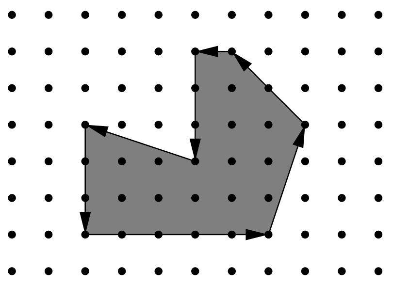

## 문제

Being well known for its highly innovative products, Merck would definitely be a good target for industrial espionage. To protect its brand-new research and development facility the company has installed the latest system of surveillance robots patrolling the area. These robots move along the walls of the facility and report suspicious observations to the central security office. The only flaw in the system a competitor’s agent could find is the fact that the robots radio their movements unencrypted. Not being able to find out more, the agent wants to use that information to calculate the exact size of the area occupied by the new facility. It is public knowledge that all the corners of the building are situated on a rectangular grid and that only straight walls are used. Figure 1 shows the course of a robot around an example area.

Figure 1: Example area.

You are hired to write a program that calculates the area occupied by the new facility from the movements of a robot along its walls. You can assume that this area is a polygon with corners on a rectangular grid. However, your boss insists that you use a formula he is so proud to have found somewhere. The formula relates the number I of grid points inside the polygon, the number E of grid points on the edges, and the total area A of the polygon. Unfortunately, you have lost the sheet on which he had written down that simple formula for you, so your first task is to find the formula yourself.

## 입력

The first line contains the number of scenarios.

For each scenario, you are given the number m, 3 ≤ m < 100, of movements of the robot in the first line. The following m lines contain pairs “dx dy” of integers, separated by a single blank, satisfying −100 ≤ dx, dy ≤ 100 and (dx, dy) ≠ (0, 0). Such a pair means that the robot moves on to a grid point dx units to the right and dy units upwards on the grid (with respect to the current position).

You can assume that the curve along which the robot moves is closed and that it does not intersect or even touch itself except for the start and end points. The robot moves anti-clockwise around the building, so the area to be calculated lies to the left of the curve. It is known in advance that the whole polygon would fit into a square on the grid with a side length of 100 units.

## 출력

The output for every scenario begins with a line containing “Scenario #i:”, where i is the number of the scenario starting at 1. Then print a single line containing I, E, and A, the area A rounded to one digit after the decimal point. Separate the three numbers by two single blanks. Terminate the output for the scenario with a blank line.
