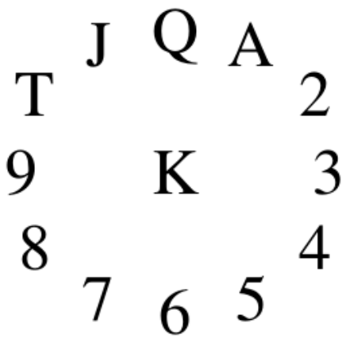

## 문제

Card sharp Albert (Foxy) Smith is writing a book on patience games. To double check the examples in the book, he is writing programs to find the optimal play of a given deal. The description of Clock Patience reads as follows: "The cards are dealt out (face down) in a circle, representing a clock, with a pile in each hour position and an extra pile in the centre of the clock. The first card goes face down on one o'clock, the next on two, and so on clockwise from there, with each thirteenth card going to the center of the clock. This results in thirteen piles, with four cards face down in each pile.

The game then starts. The top card of the 'king' pile (the last card dealt) is exposed to become the current card. Each move thereafter consists of placing the current card face up beneath the pile corresponding to its value and exposing the top card of that pile as the new current card. Thus if the current card is an Ace it is placed under the 'one' pile and the top card of that pile becomes the current card. The game ends when the pile indicated by the current card has no face down cards in it. You win if the entire deck is played out, i.e. exposed."

Write a program that will read in a number of shuffled decks, and play the game.

## 입력

The input will consist of decks of cards arranged in four lines of 13 cards, cards separated by a single blank. Each card is represented by two characters, the first is the rank (A, 2, 3, 4, 5, 6, 7, 8, 9, T, J, Q, K) followed by the suit (H, D, C, S). The input will be terminated by a line consisting of a single #. The deck is listed from bottom to top, so the first card dealt is the last card listed.

## 출력

The output will consist of one line per deck. Each line will contain the number of cards exposed during the game (2 digits, with a leading zero if necessary), a comma, and the last card exposed (in the format used in the input).
