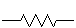
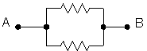
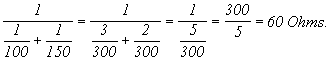

## 문제

A common component in electronic circuits is the resistor. Each resistor has two terminals, and when current flows through a resistor, some of it is converted to heat, thus “resisting” the flow of the current. The extent to which it does this is indicated by a single positive numeric value, cleverly called the resistance of the resistor. By the way, the units of resistance are Ohms. Here's what a single resistor looks like in a diagram of an electronic circuit:



When two resistors are connected in series, as shown below, then their equivalent resistance is just the sum of the resistances of the individual resistors. For example, if the two resistors below had resistances of 100 and 200 Ohms, respectively, then the combined resistance (from point A to point B) would be 300 Ohms. Of course, combining three or more resistors in series would yield a resistance equal to sum of all the individual resistances.


Resistors may also be connected in parallel, like this:



If these two resistors had resistances of 100 and 150 Ohms, then the parallel combination would yield an equivalent resistance between points A and B of



Connecting three resistors in parallel uses the same rule, so a 100 Ohm, 150 Ohm, and 300 Ohm resistor in parallel would yield a combined resistance of just 50 Ohms—that is, 1/(1/100+1/150+1/300) Ohms.

In this problem you're provided one or more descriptions of resistors and their interconnections. Each possible interconnection point (the terminals of a resistor) is identified by a unique positive integer, its label. And each resistor is specified by giving its two interconnection point labels and its resistance (as a real number). For example, the input

```

1   2   100
```

would tell us that a 100 Ohm resistor was connected between points 1 and 2. A pair of resistors connected in series might be specified like this:

```

1   2   100
2   3   200
```

Here we've got our 100 Ohm resistor connected at points 1 and 2, and another 200 Ohm resistor connected to points 2 and 3. Two resistors in parallel would be similarly specified:

```

1   2   100
1   2   150
```

Once you know how the resistors are interconnected, and the resistance of each resistor, it's possible to determine the equivalent resistance between any two points using the simple rules given above. In some cases, that is. Some interconnections of resistors can't be solved using this approach--you won't encounter any of these in this problem, however.

## 입력

There will be one or more cases to consider. Each will begin with a line containing three integers N, A, and B. A and B indicate the labels of points between which you are to determine the equivalent resistance. N is the number of individual resistors and will be no more than 30. N, A and B will all be zero in the line following the last case. Following each "N A B" line will be N lines, each specifying the labels of the points where a resistor is connected, and the resistance of that resistor, given as a real number.

## 출력

For each input case, display a line that includes the case number (they are numbered sequentially starting with 1) and the equivalent resistance, accurate to two decimal places.

## 힌트

**Notes**

1. Be aware that there may be input test cases with some resistors that don't contribute to the overall resistance between the indicated points. For example, in the last case shown in the Sample Input section below, the resistor between points 1 and 2 is unused. There must be some flow through a resistor if it is to contribute to the overall resistance.
2. No resistor will have its ends connected together. That is, the labels associated with the ends of a resistor will always be distinct.
