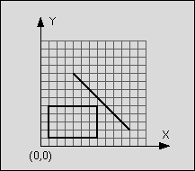

## 문제

입력으로 주어진 선분과 직사각형이 교차하는지 아닌지를 구하는 프로그램을 작성하시오.

위의 그림에서 선분의 시작점은 (4,9), 끝점은 (11,2) 이며, 직사각형의 왼쪽 위 좌표는 (1,5), 오른쪽 아래 좌표는 (7, 1)이다. 또, 선분과 직사각형은 교차하지 않는다.

선분과 직사각형이 교차하려면 적어도 한 점을 공유해야한다. 입력으로 주어지는 좌표는 모두 절댓값이 50보다 작거나 같은 정수이지만, 교점은 정수 좌표가 아닐 수도 있다. 직사각형의 넓이는 0일 수도 있다.

## 입력

첫째 줄에 테스트 케이스의 개수가 주어진다. 각 테스트 케이스는 한 줄로 이루어져 있으며, xstart ystart xend yend xleft ytop xright ybottom로 이루어져 있다. (xstart, ystart)는 선분의 시작점, (xend, yend)는 선분의 끝점이고, (xleft, ytop)는 직사각형의 한 쪽 모서리 좌표, (xright, ybottom)는 직사각형 반대쪽 모서리 좌표이다.

xleft ytop xright ybottom 은 직사각형의 왼쪽, 오른쪽, 위, 아래 좌표를 의미하는 것은 아니며, 변수명은 우연의 일치이다.

## 출력

각 테스트 케이스마다 선분과 직사각형이 교차하면 'T'를, 교차하지 않으면 'F'를 한 줄에 하나씩 출력한다. 선분의 두 점이 사각형 내부에 있을 때도 'T'이다.
