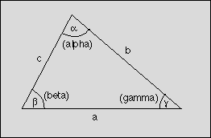

## 문제

A triangle is a basic shape of planar geometry. It consists of three straight lines and three angles in between. Figure 1 shows how the sides and angles are usually labeled.

Figure 1: Triangle

A look into a book about geometry shows that many formulas for triangles exist:

\[\alpha + \beta + \gamma  = \pi \\ \frac{a} {\sin{\alpha}} = \frac{b} {\sin{\beta}} = \frac{c} {\sin{\gamma}} \\ a = b \cos{\gamma} + c \cos{\beta} \\ a^2 = b^2 + c^2 - 2bc\cos {\alpha}  \\ \frac{a - b}{a + b} = \tan{\frac{\alpha - \beta}{2}} / \tan{\frac{\alpha + \beta}{ 2}}\]

The values of a, b, c, alpha, beta, and gamma form a set of six parameters that fully define a triangle. If a large enough subset of these parameters is given, the missing ones can be calculated by using the formulas above.

You are to write a program that calculates the missing parameters for a given subset of the six parameters of a triangle. For some sets of parameters, it is not possible to calculate the triangle because either too few is known about the triangle or the parameters would lead to an invalid triangle. The sides of a valid triangle are greater than 0 and the angles are greater than 0 and less than pi. Your program should detect this case and output: "Invalid input." The same phrase should be output if more than the minimal set needed to compute the triangle is given but the parameters conflict with each other, e.g. all three angles are given but their sum is greater than pi.

Other sets of parameters can lead to more than one but still a finite number of valid solutions for the triangle. In such a case, your program should output: "More than one solution."

In all other cases, your program should compute the missing parameters and output all six parameters.

## 입력

The first line of the input file contains a number indicating the number of parameter sets to follow. Each following line consists of six numbers, separated by a single blank character. The numbers are the values for the parameters a, alpha, b, beta, c, and gamma respectively. The parameters are labeled as shown in figure 1. A value of -1 indicates that the corresponding parameter is undefined and has to be calculated. All floating-point numbers include at least eight significant digits.

## 출력

Your program should output a line for each set of parameters found in the input file. If a unique solution for a valid triangle can be found for the given parameters, your program should output the six parameters a, alpha, b, beta, c, gamma, separated by a blank character. Otherwise the line should contain the phrase "More than one solution." or "Invalid input." as explained above.

The numbers in the output files should include at least eight significant digits. Your calculations should be precise enough to get the six most significant digits correct.
