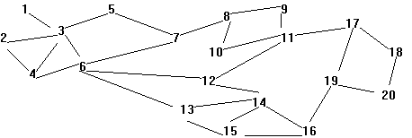

## 문제

Risk is a board game in which several opposing players attempt to conquer the world. The gameboard consists of a world map broken up into hypothetical countries. During a player's turn, armies stationed in one country are only allowed to attack only countries with which they share a common border. Upon conquest of that country, the armies may move into the newly conquered country.

During the course of play, a player often engages in a sequence of conquests with the goal of transferring a large mass of armies from some starting country to a destination country. Typically, one chooses the intervening countries so as to minimize the total number of countries that need to be conquered. Given a description of the gameboard with 20 countries each with between 1 and 19 connections to other countries, your task is to write a function that takes a starting country and a destination country and computes the minimum number of countries that must be conquered to reach the destination. You do not need to output the sequence of countries, just the number of countries to be conquered including the destination. For example, if starting and destination countries are neighbors, then your program should return one.

The following connection diagram illustrates the first sample input.

## 입력

Input to your program will consist of a series of country configuration test sets. Each test set will consist of a board description on lines 1 through 19. The representation avoids listing every national boundary twice by only listing the fact that country I borders country J when I < J. Thus, the Ith line, where I is less than 20, contains an integer X indicating how many "higher-numbered" countries share borders with country I, then X distinct integers J greater than I and not exceeding 20, each describing a boundary between countries I and J. Line 20 of the test set contains a single integer (1 <= N <= 100) indicating the number of country pairs that follow. The next N lines each contain exactly two integers (1 <= A,B <= 20; A!=B) indicating the starting and ending countries for a possible conquest.

There can be multiple test sets in the input file; your program should continue reading and processing until reaching the end of file. There will be at least one path between any two given countries in every country configuration.

## 출력

For each input set, your program should print the following message "Test Set #T" where T is the number of the test set starting with 1 (left-justified starting in column 11). The next NT lines each will contain the result for the corresponding test in the test set - that is, the minimum number of countries to conquer. The test result line should contain the start country code A right-justified in columns 1 and 2; the string " to " in columns 3 to 6; the destination country code B right-justified in columns 7 and 8; the string ": " in columns 9 and 10; and a single integer indicating the minimum number of moves required to traverse from country A to country B in the test set left-justified starting in column 11. Following all result lines of each input set, your program should print a single blank line.
