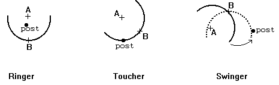
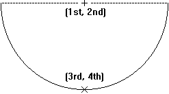

## 문제

The game of horseshoes is played by tossing horseshoes at a post that is driven into the ground. Four tosses generally make up a game. The scoring of a toss depends on where the horseshoe lands with respect to the post. If the center of the post is within the region bounded by the interior of the horseshoe and the imaginary line connecting the two legs of the horseshoe, and the post is not touching the horseshoe, it is a "ringer" and worth five points. If any part of the horseshoe is touching the post, it is a "toucher" and worth 2 points. If the toss is neither a ringer nor a toucher and some part of the horseshoe will touch the post when it is pivoted around its point B, it is a "swinger" and worth 1 point. Any horseshoe which does not fit any of the scoring definitions scores zero points. See the figures below for examples of each of the scoring possibilities.

This program uses mathematical horseshoes that are semicircles with radius 10 centimeters. The location of the horseshoe is the given by two points: the centerpoint of the semicircle, measured in centimeters relative to x and y axes, and the point that exactly bisects the semicircle. The post is at location (0,0) and is 2 centimeters in diameter. The top of the post is level with the ground allowing the horseshoe to lay on top of the post; therefore, a "toucher" would mean that any part of the horseshoe lies within the circle with a radius of 1 centimeter centered at (0, 0).

Each "turn" consists of four tosses. The purpose of your program is to determine the score of the "turn" by computing the sum of the point values for each of the four tosses.

## 입력

Input to your program is a series of turns, and a turn consists of four horseshoe positions. Each line of input consists of two coordinate pairs representing the position of a toss. Each coordinate consists of a floating point (X,Y) coordinate pair (-100.0 <= X, Y <= 100.0) with up to 3 digits of precision following the decimal point; the first and second numbers are the X and Y coordinates of the centerpoint of the horseshoe semicircle (Point A) and the third and fourth numbers are the X and Y coordinates of the point (B) which bisects the horseshoe semicircle. You can be assured that the distance between points A and B for each horseshoe will be exactly 10 centimeters. The figure below illustrates the meanings of the values on each line.

The first four lines of input define the horseshoe positions for the first turn; lines 5 through 8 define the second turn, etc. There are at most 999 turns in the input file, and every turn contains four horseshoe positions. Your program should continue reading input to the end of file.

## 출력

The first line of output for your program should be the string "Turn Score" in columns 1 through 10. For each "turn", your program should print the number of the turn right-justified in columns 1-3 (turns are numbered starting with 1), a single space (ASCII character 32 decimal) in columns 4 and 5, and the score for the turn right-justified in columns 6 and 7 with a single leading blank for scores 0 to 9. Numbers that are right-justified should be preceded by blanks, not zeroes, as the fill character.
