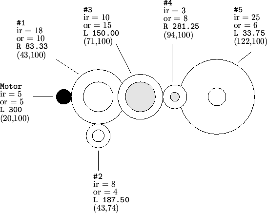

## 문제

An engineering firm called "Gears R Us" needs a program which can evaluate the operation of gears on a board. The board is a two-dimensional mounting plane which allows gears with two levels of teeth (an inside radius closest to the board and an outside radius away from the board). The gears rotate around the center of their diameter and interact by turning an adjacent gear which it touches (either on the inside or outside radiuss) with a equal tangential velocity. Angular velocity is the same for both the inside and outside radius gears.

"Gears R Us" uses square mounting boards which have a 300x300 grid of mounting holes on 1 cm centers. When viewing the board, the lower left of the board is position x=1, y=1; the upper right of the board is position x=300, y=300. The gears mount only on mounting holes and are available with integer inside and outside radii between 1 and 100. The "motor" gear is the only original source of energy of any board and is actually a gear (powered from behind the board) subject to all the restrictions described for gears above. The following diagram shows a sample configuration.

In the above example, the motor is at location X=20, Y=100; the inside and outside radii of the gears the motor drives are both 5 centimeters, and the motor is rotating to the left (counter-clockwise) at 300 RPM's. By observation and computation, you can see that the motor touches (without overlapping) the inside radius of Gear #1. The inside radius of Gear #1 touches the inside radius of Gear #2 and Gear #3. The outside radius of Gear #3 touches the outside radius of Gear #4; the inside radius of Gear #4 touches the inside radius of Gear #5.

Given the data in the above example, it is possible to compute that Gear #1 rotates to the right (clockwise) at 83.33 RPM's; Gear #2 rotates to the left (counter-clockwise) at 187.50 RPM's; Gear #3 rotates to the left at 150.00 RPM's; Gear #4 rotates to the right at 187.50 RPM's; and Gear #5 rotates to the left at 22.50 RPM's.

Although this example does not include any off-nominal conditions, "Gears R Us" needs your program to isolate two error conditions. The first error occurs when two or more gears would overlap at either the inner or outter radius. The second error condition occurs when any gear is being driven at two or more different speeds. It is valid for two or more gears to drive another gear at the same speed (and in the same direction).

It is possible for a warning condition to occur when 1 or more gears are idle (ie rotation = 0.0). If this condition occurs, your program will have to print a warning message as described below.

## 입력

Input to your program consists of an undetermined number of configurations to be analyzed. Each set starts with a single line of six integers. The first two integers are the x,y coordinates of the motor (1 <= x, y <= 300); the next two integers are the inside and outside radii of the motor gear respectively (1 <= ir, or <= 100); the fifth integer is the rotational velocity (1 <= abs(AV) <= 1000) of the motor in RPM's (negative representing counter-clockwise rotation and positive representing clockwise rotation); the sixth integer is the number of gears (1 <= NG <= 20) excluding the motor that are mounted on the board. Each of the following NG lines contain exactly 4 integers representing gears 1 through NG respectively. The first two integers represent the x,y coordinates (1<= x, y <= 300) of the gear and the second pair of integers represent the inside and outside radii of the gear respectively (1 <= ir, or <= 100).

## 출력

For each input set, your program should print either a list of the gears and the rotation value for each or one of two error messages. The first line of each output set should be a line containing only "Simulation #X" where 'X' is the simulation number (starting with 1) and is left-justified starting in column 13.

If there are no errors, lines 2 through NG+1 of the output set should contain the gear number right-justified in columns 1 and 2, a colon in column 3, either a 'L' for counter-clockwise rotation of the gear or a 'R' for clockwise rotation in column 5, and the magnitude of the rotation always printed with two digits to the right of the decimal point and are left-justified starting in column 7. If any gear has rotation of magnitude zero, you should print the message "Warning -- Idle Gear" in columns 5 through 24 instead of the rotation direction and magnitude.

If there is an error, your program should print only the first line containing "Simulation #X" and a second line containing only one of two error messages left-justified in column 1. If there is an overlapping of two or more gears at either in inner or outter radii, your program should print the message "Error -- Overlapping Gears". If there is any gear which is being driven by two or more different vectors, your program should print the message "Error -- Conflicting Gear Rotation". Your program should give precedence to the overlapping error condition.

The last line of output for each output set should be an empty line.
