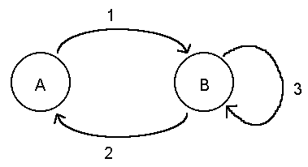

## 문제

A finite state machine (FSM) is essentially a directed graph. Each node in the graph is called a state; at any point during execution of the FSM, one of the states is said to be the current state. Each directed edge between two states is called a transition. When the conditions are right, one of the transitions from the current state is said to occur, and the current state changes to a new state as determined by the transition. Consider the following very simple example.

There are two states in this FSM, labeled A and B, and three transitions, labeled 1, 2, and 3. If the current state is A, and the conditions for transition 1 are met, then the current state becomes B. When the current state is B, and the conditions for transition 2 are met, the current states becomes A again. If the current state is B and the conditions for transition 3 are met, the current state remains B.

In this problem the input will be descriptions of several FSMs. Each transition in these FSMs has an associated set of characters called the input set, and a string called the output string. A transition can occur when the current input data character is in the transition's input set. When the transition occurs, the output string is printed.

## 입력

The input consists of a sequence of pairs {FSM description, input for the FSM}. A FSM is described by the following sequence of items separated by whitespace (blanks, tabs, and end of line characters):

* An integer specifying the number of states in the FSM. for each of these states there will be the following items, in order:
  + A one to eight character name for the state. State names are case significant, and unique
  + An integer specifying the number of transitions that leave the current state. For each of these transitions there will be the following data items, in order:
    - The set of input characters that enable the transition (see below). the name of the new current state when this transition occurs
    - The output string (see below).

The input set and the output string are given as sequences of printable characters with no imbedded whitespace. Several special constructions may appear in these, however. When \b appears it is to be interpreted as a blank. Treat \n as an end of line, and \\ as a single backslash. The construction \0 (that is, backslash followed by zero) will appear only as an output string, and means to print nothing when the transition occurs. The construction \c appearing as an input set matches anything. That is, if none of the other transitions are enabled and a transition has \c specified as its input set, then it is enabled. When \c appears in an output string, it means to print the current input character. this could appear several times in the same output string.

After the last item in the description of and FSM has been read begin ìexecutingî the FSM using the characters that start on the first complete line following the description. the beginning state will always be called START. The final state will always e called END, but will not appear as a state in the description of a FSM. All input is guaranteed to be correct.

## 출력

For each input your program should display the FSM number (1, 2, ...) and, beginning on the next line, the output that results from those transitions that occur. The examples below illustrate this.

The first example FSM replaces each vowel in a single line of input with an asterisk. The second example will delete each vowel that follows a lower or upper case X, again processing only a single line of input. The final example changes the case of each odd-numbered vowel in the input; processing stops when an exclamation point is encountered, and the remainder of the input line is ignored.
