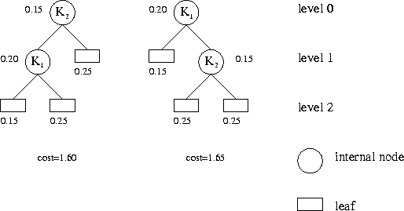

## 문제

In the following we define the basic terminology of trees. A tree is defined inductively: It has a root which is either an external node (a leaf), or an internal node having a sequence of trees as its children. An internal node is also called the parent of the roots of its child trees. The level of a node in a tree is defined inductively: The root has level *0*, and the level of a node is *1* more than the level of its parent node.

Every internal node of a binary tree has precisely two children, its left sub-tree and its right sub-tree. Every internal node of a labelled binary tree is additionally marked with a string, its label. A binary search tree is a labelled binary tree where every internal node *t* satisfies the following condition: All labels of nodes in the left sub-tree of *t* are less than the label of *t* which is, in turn, less than all labels of nodes in the right sub-tree of *t*. For this condition, we assume lexicographic, i.e., alphabetic order on the strings.

An inorder traversal of a tree is defined recursively: A leaf is just visited, and for an internal node first its left sub-tree is traversed inorder, then the node itself is visited, finally its right sub-tree is traversed inorder. It follows that an inorder traversal of a binary search tree yields the labels in lexicographic order. Note that binary search trees whose shapes differ may nevertheless yield the same sequence of strings while being traversed inorder.

When a given string *s* is looked for in a binary search tree, we compare *s* to the label *l* of the root. We are done if *s=l*, otherwise if *s<l* we continue to search in the left sub-tree, and if *s>l* in the right sub-tree. If a leaf is reached, we know that *s* is not in the tree.

The number of comparisons performed in such a search procedure depends on *s* and the actual shape of the search tree. Therefore, there is an interest in constructing binary search trees that store a given sequence of strings but provide as efficient access as possible. Of course, we don't know in advance which strings will be looked up in the tree, so we need to make some assumptions.

Let *n* be the number of strings that are to be stored in the binary search tree. Let *K1,...,Kn* be these strings in lexicographic order. Let *p1,...,pn* and *q0,...,qn* be *2n+1* non-negative real numbers such that *∑i=1..n pi + ∑i=0..n qi = 1*. The interpretation of these numbers is:

* *pi* = probability that the search argument *s* is *Ki*.
* *qi* = probability that *s* lies (lexicographically) strictly between *Ki* and *Ki+1*.

By convention, *q0* is the probability that *s* is less than *K1*, and *qn* is the probability that *s* is greater than *Kn*. We want to find a binary search tree containing nodes with labels *K1,...,Kn* that minimises the expected number of comparisons in the search, namely

*cost = ∑i=1..n pi\*(1 + level of internal node Ki) + ∑i=0..n qi\*(level of leaf between Ki and Ki+1)*.

The leaf between *Ki* and *Ki+1* is that leaf reached in the search for a string *s* that lies (lexicographically) strictly between *Ki* and *Ki+1*. Adhere to the convention stated above for the border cases.

The following figure illustrates the first test case of the sample input. It shows the two possible binary search trees, the probabilities and the associated costs.

## 입력

The input contains several test cases. Every test case starts with an integer *n*. You may assume that *1<=n<=200*. Then follow *2n+1* non-negative integers denoting frequencies. Let *s* be the sum of all frequencies. You may assume that *1<=s<=1000000*. The probabilities *p1,...,pn* and *q0,...,qn* are calculated in this order by dividing the frequencies by *s*. The last test case is followed by a zero.

## 출력

For each test case devise a binary search tree whose cost is minimal for the specified probabilities. Output the integer *cost\*s* for such a tree.
