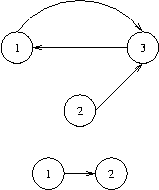

## 문제

방향 그래프 *G* = (*V*, *E*)가 주어져 있다.

임의의 노드 *u*, *v* ∈ *V*에 대해서 *u*에서 *v*로 E에 포함된 간선만을 이용해 갈 수 있는 경로가 있으면 *u*→*v*로 표현한다.

만약 어떤 노드 *v* ∈ *V*가 자신으로부터 도달할 수 있는 모든 노드로부터 돌아오는 경로가 있다면, 즉 다음 조건을 만족한다면 노드 *v* ∈ *V*를 싱크라고 부른다.

* 조건: ∀*w* ∈ *V*, (*v*→*w*) ⇒ (*w*→*v*)

또한, 그래프 *G*의 싱크를 모아놓은 집합을 bottom(G)로 표현한다.

* bottom(*G*) = {*v* ∈ *V*: ∀*w* ∈ *V*, (*v*→*w*) ⇒ (*w*→*v*)}

주어진 그래프 *G*=(*V*, *E*)의 bottom(*G*)를 구하시오.

## 입력

입력은 여러 개의 테스트 케이스로 구분되어 있다.

각 테스트 케이스의 첫 줄에는 노드의 수 *n* (1 ≤ *n* ≤ 5,000)과 음이 아닌 정수 *m* (0 ≤ m ≤ 100,000)이 주어진다. *V* = {1, 2, ..., *n*}이고, 간선의 수 |*E*|=*m*임을 의미한다.

그 다음부터는 각 간선을 나타내는 *m*쌍의 수 *v*1 *w*1 *v*2 *w*2 ... *vm* *wm*이 공백으로 구분되어 주어진다. 이는 (*vi*, *wi*) ∈ *E*를 의미한다.

마지막 줄에 0이 주어지고, 이 경우는 처리하지 않고 프로그램을 종료시켜야 한다.

## 출력

각 테스트 케이스마다 한 줄에 걸쳐 bottom(*G*)의 모든 노드를 출력한다. 노드는 공백으로 구분해야 하며, 오름차순이어야 한다. 만약, bottom(*G*)가 공집합이면 빈 줄을 출력한다.

## 힌트

