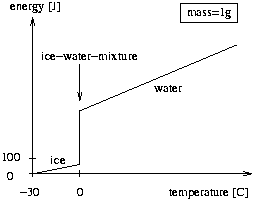

## 문제

A good drink is always served on ice. That said, the amount of ice is what makes the difference. If it is too much, the drink will be well cooled, however, this is a bit of fraud as there could be less ice (and more Vodka for example). On the other hand, if there is too little ice the drink is warm which is unacceptable. You are to help the bartender, of course neither with mixing nor drinking, but with calculating the expected outcome of such mixtures.

To make things easier, we assume that pure water is mixed with ice in a closed system, i.e., there is no problem with the outside temperature or the warming of the bottle, etc. Therefore, after a some time has passed, the system may be regarded as balanced (there is no further change in temperature and no more melting or freezing). Your job is to calculate the final temperature of this balanced system and the amount of ice and water in this equilibrium state.

As you know from physics, it takes 4.19 Joule to heat one gram of water one Kelvin, whereas it takes 2.09 Joule if it is ice. We define the capacities *cw = 4.19 J/(g\*K)* and *ci = 2.09 J/(g\*K)*. Melting one gram of ice takes 335 Joule, where the temperature remains constant at zero. We define the constant *em = 335 J/g*. The total thermal energy of the ice and the water before the experiment is equal to the thermal energy of the final mixture.

The figure below shows the energy of one gram of ice, ice-water-mixture, or water, where the temperature is measured relative to -30 degrees Celsius. The jump at 0 degrees represents the melting of ice to water. The amount of energy gained is proportional to the amount of ice already melted.

## 입력

The input contains several test cases. Each test case consists of four real numbers *mw, mi, tw, ti*. The mass of water *mw* and the mass of ice *mi* are both non-negative, given in grams, and *mw + mi > 0*. The water temperature *tw* and the ice temperature *ti* follow, both given in degrees Celsius, and you may assume that *-30 < ti <= 0 <= tw < 100*. The last test case is followed by four zeroes.

## 출력

For each test case output the amount of ice and water in grams and the final temperature of the mixture in degrees Celsius. All numbers must be rounded to one digit. Adhere to the sample output for the exact format to use.

## 힌트

