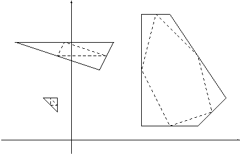

## 문제

Read the statement of Problem 6553! Given a list of meeting locations as specified in the description of Problem 6553, you have to calculate the locations of the Foreign Offices.

## 입력

See the input specification of Problem 6553 for the format, and the output specification of Problem 6553 for the meaning of the input.

## 출력

See the output specification of Problem 6553 for the format, and the input specification of Problem 6553 for the meaning of the output.

## 힌트

The relationship between the sample input and output polygons is illustrated in the figure below. Solid lines indicate the polygon joining the Foreign Offices, whereas dashed lines indicate the polygon joining the meeting locations. To generate further sample input you may use your solution to Problem 6553.

