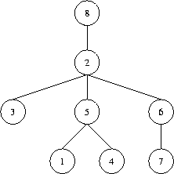

## 문제

A tree (i.e. a connected graph without cycles) with vertices numbered by the integers *1, 2, ..., n* is given. The "Prufer" code of such a tree is built as follows: the leaf (a vertex that is incident to only one edge) with the minimal number is taken. This leaf, together with its incident edge is removed from the graph, while the number of the vertex that was adjacent to the leaf is written down. In the obtained graph, this procedure is repeated, until there is only one vertex left (which, by the way, always has number *n*). The written down sequence of *n-1* numbers is called the Prufer code of the tree.

Your task is, to reconstruct a tree, given its Prufer code. The tree should be denoted by a word of the language specified by the following grammar:

```

T ::= "(" N S ")"
S ::= " " T S
    | empty
N ::= number
```

That is, trees have parentheses around them, and a number denoting the identifier of the root vertex, followed by arbitrarily many (maybe none) subtrees separated by a single space character. As an example, take a look at the tree in the figure below which is denoted in the first line of the sample output. To generate further sample input, you may use your solution to Problem C.

Note that, according to the definition given above, the root of a tree may be a leaf as well. It is only for the ease of denotation that we designate some vertex to be the root. Usually, what we are dealing here with is called an "unrooted tree".

## 입력

The input contains several test cases. Each test case specifies the Prufer code of a tree on one line. You will find *n-1* numbers separated by a single space. Input is terminated by EOF. You may assume that *1<=n<=50*.

## 출력

For each test case generate a single line containing the corresponding tree, denoted as described above. Note that, in general, there are many ways to denote such a tree: choose your favourite one

## 힌트


