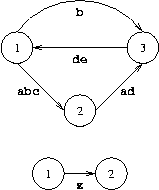

## 문제

Several startup companies have decided to build a better Internet, called the "FiberNet". They have already installed many nodes that act as routers all around the world. Unfortunately, they started to quarrel about the connecting lines, and ended up with every company laying its own set of cables between some of the nodes.

Now, service providers, who want to send data from node *A* to node *B* are curious, which company is able to provide the necessary connections. Help the providers by answering their queries.

## 입력

The input contains several test cases. Each test case starts with the number of nodes of the network *n*. Input is terminated by *n=0*. Otherwise, *1<=n<=200*. Nodes have the numbers *1, ..., n*. Then follows a list of connections. Every connection starts with two numbers *A, B*. The list of connections is terminated by *A=B=0*. Otherwise, *1<=A,B<=n*, and they denote the start and the endpoint of the unidirectional connection, respectively. For every connection, the two nodes are followed by the companies that have a connection from node *A* to node *B*. A company is identified by a lower-case letter. The set of companies having a connection is just a word composed of lower-case letters.

After the list of connections, each test case is completed by a list of queries. Each query consists of two numbers *A, B*. The list (and with it the test case) is terminated by *A=B=0*. Otherwise, *1<=A,B<=n*, and they denote the start and the endpoint of the query. You may assume that no connection and no query contains identical start and end nodes.

## 출력

For each query in every test case generate a line containing the identifiers of all the companies, that can route data packages on their own connections from the start node to the end node of the query. If there are no companies, output `"-"` instead. Output a blank line after each test case.

## 힌트

