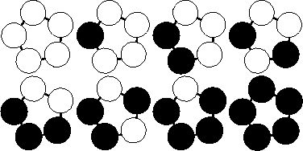

## 문제

"Let it Bead" company is located upstairs at 700 Cannery Row in Monterey, CA. As you can deduce from the company name, their business is beads. Their PR department found out that customers are interested in buying colored bracelets. However, over 90 percent of the target audience insists that the bracelets be unique. (Just imagine what happened if two women showed up at the same party wearing identical bracelets!) It's a good thing that bracelets can have different lengths and need not be made of beads of one color. Help the boss estimating maximum profit by calculating how many different bracelets can be produced.

A bracelet is a ring-like sequence of *s* beads each of which can have one of *c* distinct colors. The ring is closed, i.e. has no beginning or end, and has no direction. Assume an unlimited supply of beads of each color. For different values of *s* and *c*, calculate the number of different bracelets that can be made.

## 입력

Every line of the input file defines a test case and contains two integers: the number of available colors *c* followed by the length of the bracelets *s*. Input is terminated by *c=s=0*. Otherwise, both are positive, and, due to technical difficulties in the bracelet-fabrication-machine, *cs<=32*, i.e. their product does not exceed 32.

## 출력

For each test case output on a single line the number of unique bracelets. The figure below shows the 8 different bracelets that can be made with 2 colors and 5 beads.

## 힌트

