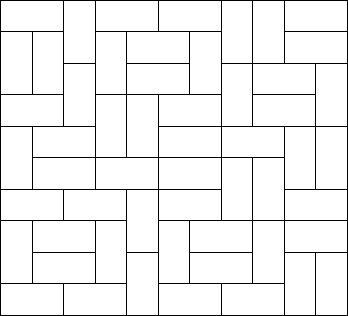

## 문제

네델란드의 미술 화가 피트 몬드리안은 정사각형과 직사각형에 매료되어 있었다.

어느 날 그는 꿈에서 너비가 2, 높이가 1인 작은 직사각형을 이용해서 큰 직사각형을 채우는 꿈을 꾸었다.

직사각형의 크기가 주어졌을 때, 이 직사각형을 작은 직사각형으로 채우는 방법의 수를 구하는 프로그램을 작성하시오.

## 입력

입력은 여러 개의 테스트 케이스로 이루어져 있다. 각 테스트 케이스는 큰 직사각형의 높이 h와 너비 w로 이루어져 있다. 입력의 마지막 줄에는 0이 두 개 주어진다. (1 ≤ h, w ≤ 11)

## 출력

각 테스트 케이스에 대해서, 입력으로 주어진 큰 직사각형을 작은 직사각형 2 × 1 로 채우는 방법의 수를 출력한다. (큰 직사각형은 방향이 있다. 즉, 대칭하는 방법을 여러 번 세야 한다)

## 힌트

