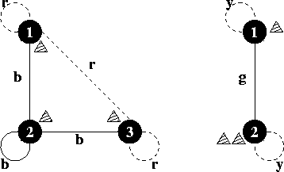

## 문제

"Hike on a Graph" is a game that is played on a board on which an undirected graph is drawn. The graph is complete and has all loops, i.e. for any two locations there is exactly one arrow between them. The arrows are coloured. There are three players, and each of them has a piece. At the beginning of the game, the three pieces are in fixed locations on the graph. In turn, the players may do a move. A move consists of moving one's own piece along an arrow to a new location on the board. The following constraint is imposed on this: the piece may only be moved along arrows of the same colour as the arrow between the two opponents' pieces.

In the sixties ("make love not war") a one-person variant of the game emerged. In this variant one person moves all the three pieces, not necessarily one after the other, but of course only one at a time. Goal of this game is to get all pieces onto the same location, using as few moves as possible. Find out the smallest number of moves that is necessary to get all three pieces onto the same location, for a given board layout and starting positions.

## 입력

The input file contains several test cases. Each test case starts with the number *n*. Input is terminated by *n=0*. Otherwise, *1<=n<=50*. Then follow three integers *p1, p2, p3* with *1<=pi<=n* denoting the starting locations of the game pieces. The colours of the arrows are given next as a *m×m* matrix of whitespace-separated lower-case letters. The element *mij* denotes the colour of the arrow between the locations *i* and *j*. Since the graph is undirected, you can assume the matrix to be symmetrical.

## 출력

For each test case output on a single line the minimum number of moves required to get all three pieces onto the same location, or the word "impossible" if that is not possible for the given board and starting locations.

## 힌트

