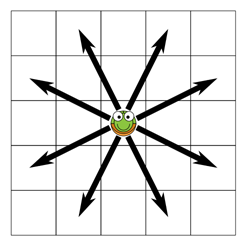

## 문제

Gregory is a grasshopper. His favourite food are clover leafs — he can simply never have enough of them. Whenever he spots such a leaf, he wants to eat it as quickly as possible. Gregory is also lazy, so he wants to move to the leaf with minimal effort. Your task is to help him to find the shortest way to a clover leaf.

For simplicity, we will assume that Gregory lives on a rectangular grid consisting of unit squares. As a grasshopper, he prefers to move by jumping (or, more exactly, hopping) from one square to the other. Each hop takes him to a square that is in the adjacent row or column in one direction, and two columns or rows away in the other direction. So, his hops resemble the moves of a knight on a chessboard.

## 입력

The input consists of several test cases, each of them specified by six integer numbers on one line: R, C, GR, GC, LR, and LC. R and C specify the size of the grid in unit squares, 1 ≤ R, C ≤ 100. Gregory cannot hop outside a rectangle of this size, because it would be too dangerous. The values of GR, GC are the coordinates of the square that Gregory is standing on, and LR, LC are the coordinates of the square with the delicious clover leaf. (1 ≤ GR, LR ≤ R; 1 ≤ GC, LC ≤ C)

## 출력

For each test case, print one integer number — the minimal number of hops that Gregory needs to reach the square with his beloved delicacy. If it is not possible to reach that square at all, print the word “impossible” instead.
