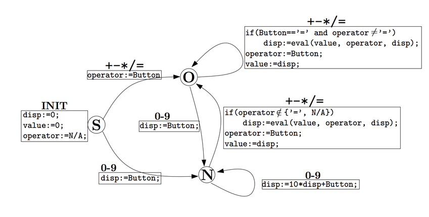

## 문제

Lisa the Ladybug likes mathematics. She counts her seven dots several times every day. To further improve her skills, she studies at the Arthropoda College in the Meadow. Today, she is preparing for an exam by her professor, Calculon the Centipede. At the exam, the student is expected to show the number of Calculon’s legs on the display of a calculator. The calculator was found many years ago among other waste in a landfill. Some of its keys are not working and the display has only three digits. The working keys form a subset of:

0 1 2 3 4 5 6 7 8 9 + − ∗ / =

Buttons “0”,“1”,. . . , “9” are called the numeric buttons, “=” is the equals button, and the other buttons are the operator buttons. The calculator also has the “C” key to reset it, but only Calculon is allowed to press it, so we will not consider it in this problem. The result of the exam depends on the number of keys pressed to obtain the prescribed value. Lisa wants a perfect score and so she needs to find the shortest possible sequence of key presses.

The work of the calculator is described by the diagram below. The calculator has three registers: disp holds the value displayed, operator is the last operator or equals button pressed and value is a stored value. At the beginning of the exam, the calculator is in the state S and the registers have the values set by the INIT block. Pressing a button B changes the state in the direction of the arrow labeled by B and the code in the block next to the arrow is executed. The result of the function eval(val1, op, val2) is the result of the operator applied on val1 and val2, that is, for example, val1 + val2.

The description may look complicated, but the calculator works in quite a standard way. There are just a few specifics and details that you should take note of:

* It displays only non-negative integers in the range [0, 999]. Obtaining a value outside this range anytime during the exam causes an error and failure at the exam.
* Result of a division is an integer; the exact result is always rounded down.
* Pressing the equals button two or more times always has the same effect as pressing it once.
* Pressing the equals button right after an operator button results in the operator being evaluated with two equal operands.
* A sequence of operator buttons behaves in the same way as if only the last button of the sequence was pressed.

For example, in the first sample input, 2 2 / 3 + and 2 2 / 3 / are among the optimal solutions, while 3 + 2 + 2 + is also a solution, but longer. In the second sample input, 3 + 2 + 2 + and 2 + = + 3 + are among the optimal solutions.

## 입력

Each line of the input describes one test case. A line starts with a non-empty list of available buttons (from the allowed set) followed by a single space and the number N (0 ≤ N ≤ 999) denoting the number of Calculon’s legs, that means the number to be displayed.

## 출력

For each test case, output a single line with the length of the shortest sequence of buttons, the pressing of which will result in the number N being displayed by the calculator. If the task cannot be solved, write a line with the word “impossible”.
