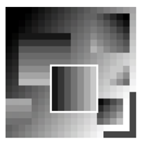

## 문제

If we need to be prepared for the possible danger of an alien invasion, the first thing to do is to find out where can they come from. One way to determine if a planet is inhabited by intelligent creatures is to study high resolution pictures of planets trying to find typical characteristics of effects of an intelligent life. There are so many habitable planets that a computer program must be written for this task. One distinctive feature of a colonized planets is the presence of surface mines. An alien mine is a square structure with a depth uniformly decreasing from one of the sides of the square towards the opposite.

Your task is to find the largest mine on a provided bitmap image of a planet. The picture is a rectangular grid of numbers between 0 and 65535, representing the shades of grey. Mines will appear as squares of either the same shade or with shade levels gradually and uniformly changing from one side to another. See the above figure for an example. Your program will consider only square mines in some special orientations.

An axis-parallel square is the set of pixels (i,j) such that c1 ≤ i ≤ c2 and r1 ≤ j ≤ r2 for some c1,c2,r1,r2, c2 − c1 = r2 − r1.

A vertically (horizontally) oriented mine is an axis-parallel square for which there exist integers S and K such that the shade of every pixel (i,j) of the square is equal to S + iK (S + jK for horizontally oriented mines).

A diagonally oriented mine is an axis-parallel square for which there exist integers Q ∈ {1, −1}, S and K such that the shade of every pixel (i,j) of the square is equal to S + (i + Qj)K.

## 입력

The input contains several descriptions of pictures. The first line of each description contains two numbers N and M (1 ≤ N,M ≤ 2000), the height and width of the picture. The following N lines contain M space-separated integers each — there is at least one space character between numbers but there may be more spaces and also additional spaces at the beginning or end of the line are allowed. The j-th number in the i-th row Ai,j (0 ≤ Ai,j ≤ 65535) describes the shade of grey of the pixel in the ith row and jth column of the picture bitmap.

The last description is followed by a line containing two zeros.

## 출력

For each picture, output the area (number of pixels inside) of the largest horizontal, vertical, or diagonal mine.
