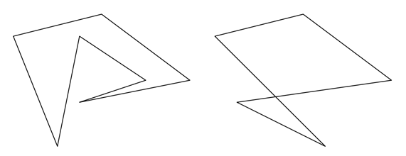

## 문제

A polygon P determined by points p1, p2, . . . , pn is a closed chain of line segments (called edges) p1p2, p2p3, . . . , pnp1 in the plane. Polygon P is simple, if no two edges have any points in common, with the obvious exception of two consecutive segments having one common point (called vertex). Note however, that if a vertex is part of any other (third) edge, the polygon is no longer simple.

Any polygon that is not simple is called self-intersecting. In two example figures below, the first polygon is simple, the second one is self-intersecting.

Your task is to determine whether a given polygon is simple or self-intersecting.

## 입력

The input contains several test cases. Each test case corresponds to one polygon. First line of the test case contains N, the number of points (1 ≤ N ≤ 40 000). Each of the following N lines contains coordinates of point Pi, that is Xi, Yi separated by space, 1 ≤ Xi,Yi ≤ 30 000.

The last test case is followed by a line containing zero.

## 출력

For each test case output either “YES” (the polygon is simple) or “NO” (the polygon is self-intersecting).
