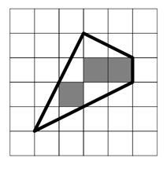

## 문제

The prime minister has recently bought a piece of valuable agricultural land, which is situated in a valley forming a regular grid of unit square fields. ACM would like to verify the transaction, especially whether the price corresponds to the market value of the land, which is always determined as the number of unit square fields fully contained in it.

Your task is to write a program that computes the market value. The piece of land forms a closed polygon, whose vertices lie in the corners of unit fields.

For example, the polygon in the picture (it corresponds to the first scenario in Sample Input) contains three square fields.

## 입력

The input consists of several test scenarios. Each scenario starts with a line containing one integer number N (3 ≤ N ≤ 100), the number of polygon vertices. Each of the following N lines contains a pair of integers Xi and Yi, giving the coordinates of one vertex. The vertices are listed in the order they appear along the boundary of the polygon. You may assume that no coordinate will be less then −100 or more than 100 and that the boundary does not touch or cross itself.

The last scenario is followed by a line containing single zero.

## 출력

For each scenario, output one line with an integer number — the number of unit squares that are completely inside the polygon.
