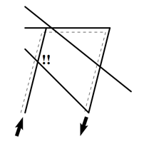

## 문제

ACM recently presented their new programme to fight against corruption by employing robots in various activities that have been performed by humans before, especially in the state machinery.

Robots have one big advantage — it is practically impossible to bribe them, whatever amount you offer.

Robots also have one big disadvantage — someone must program them to do anything useful. A robot without a program would only stand in the same place and never move.

Your task is to program a mechanical robot named Karel to allow him to move. Karel is situated in a very large hall and it can move using a special system of rails, which are built in the floor. The robot always moves across a single rail, which is so narrow that we can consider its width being zero.

All rails are formed by straight segments, which may intersect with each other (or even overlap). The robot can switch from one segment to another at any point they have in common. However, due to some technical limitations, at any single point, the robot may never turn by more than 90 degrees. In other words, all angles on Karel’s path must be obtuse.1

If we look at the picture above, it is impossible to make a turn at the crossing marked by exclamation marks and Karel must use a longer path instead (dashed line). The picture corresponds to the first scenario in Sample Input.

Your task is to find the shortest path for Karel to move from one position to another.

1obtuse angle = tupý úhel / tupý uhol

## 입력

The input will consist of several test scenarios. Each scenario starts by a line with a single positive integer R (1 ≤ R ≤ 100) — the number of rail segments. Then there are R lines, each containing four integers x1, y1, x2, y2 giving the coordinates of the endpoints of one segment. You may assume that no coordinate will be less then −10000 or more than 10000 and that all segments will have non-zero length.

The last scenario is followed by a line containing single zero.

Karel always starts at the first point given in the scenario (at the beginning of the first segment) and is facing the direction of that first segment - therefore, its first movement must start either in that direction or within an angle of 90 degrees.

The target point is the last point given in the input of that scenario (the end of the last segment). You may assume these this point is always different from the start position. It is required that Karel not only reaches the target point, but it must also remain standing in a correct direction — the direction of the last segment. Karel may either arrive there via that segment, or via a different one but with a deviation no more than 90 degrees.

## 출력

For each scenario, output one single number, rounded to exactly three digits after the decimal point (there may be unnecessary zeros). The number must state the length of the shortest path that satisfies all criteria described above. If it is not possible to reach the target point at all, output the word “unreachable” instead.
