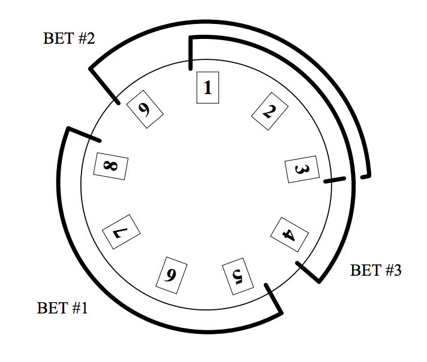

## 문제

All banks and other financial institutions want their money to earn other money. It is really simple: they invest in some assets (such as stocks), wait until their value grows, and then sell them with a high profit.

Due to the crisis, the stock exchange rates change too quickly, which caused the stocks to become too risky assets. Since large and creditable banks cannot afford so much risk, they have to search for other activities that bring similar profit but that are more predictable. Such as betting the money in casinos.

You were asked by a manager of one important bank (whose name has to be kept secret, since this is a highly confidential matter) to develop a computer program that would help them to “invest” their money into a new modern roulette, operated by Casino V¨ater Und T¨ochter (CVUT). The roulette is an unusual one. Each pocket (“number”) may have a different price that must be paid when that particular number is used in a bet. Moreover, any bet in this roulette must simultaneously cover only adjacent pockets. The price of such a bet is the sum of prices for individual pockets.

Bank managers made a decision that in every bet, one half of the pockets must be covered. They supposed that if two such bets are made, all pockets will be covered and there will be absolutely no risk of losing. But they did not realize that croupiers also have to earn some money. This is why the number zero was introduced into roulettes. Therefore, the total number of pockets is always odd and two bets are not enough to cover all of them (there would always be one pocket left).

To eliminate any risks, it was decided that two bets are not enough. In each game, three bets must be made instead of two, to cover all existing pockets. Your task is to compute the minimal price of such bets.

## 입력

aThe input contains description of several roulettes. Each roulette description consists of two lines. The first line contains a single positive odd integer N = 2 ∗ K + 1 (3 ≤ N < 200 000), the number of roulette pockets.

The second line contains N positive integers separated by a space, denoting the price of individual pockets, in the order they appear on the circumference of the wheel. The last pocket is supposed to neighbor with the first one. All prices will be between zero and 1 000.

The last roulette description is followed by a line containing zero.

## 출력

For each roulette, output the price of the optimal set of bets. The set must have following properties:

1. It contains exactly three bets.
2. Each bet covers K neighboring pockets.
3. The bets together cover all roulette pockets (of course, some numbers may be covered twice).
4. The sum of prices of the bets is minimal among all such possible sets.

The price of a bet is the sum of prices for individual pockets.
