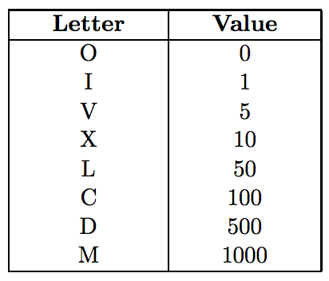
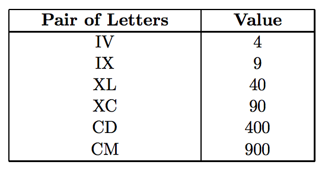

## 문제

As any other marketing company, ACM produces a lot of funky advertising items that may contain a logo and be given to customers and business partners as small gifts. A unique specialty of ACM is a calculator that uses roman numbers.

Roman numbers are able to express any non-negative integer using uppercase letters:

Numbers are created by appending several letters together, the letter representing a higher value must always precede letters with lower values. The only exception are the letters “I”, “X”, and “C”, they may be used before higher letters to form values expressed by digits 4 and 9. The only possible combinations are:

Any roman number must first express thousands, then hundreds, tens, and ones. Therefore, 499 must always be written as “CDXCIX”, not “ID”.

Although not very practical, this gift is considered extremely “cooooool”. Your task is to write software for that calculator.

## 입력

The input will consist from commands, each written on a separate line. Possible commands are assignments, “RESET”, and “QUIT”.

An assignment command starts with a single digit representing one of ten registers that the calculator has. The register number is followed by an equal sign (“=”) and an expression. The expression will consist only from valid roman numbers, register names (digits), plus (“+”) and minus (“-”) signs. You may assume that the expression will always be valid and no longer than 10000 characters.

## 출력

For each command, output a single line. For assignments, print the register name, equal sign, and the value that is being assigned to that register. Instead of it, print the word “Error”, if the expression contains a reference to a register that has not been assigned before, or if the result is negative or larger than 10000. In such cases, no change to register values is made.

For RESET commands, invalidate all previous register assignments and print the word “Ready”.

The QUIT command will be the last one. Print the word “Bye” and terminate the program.
