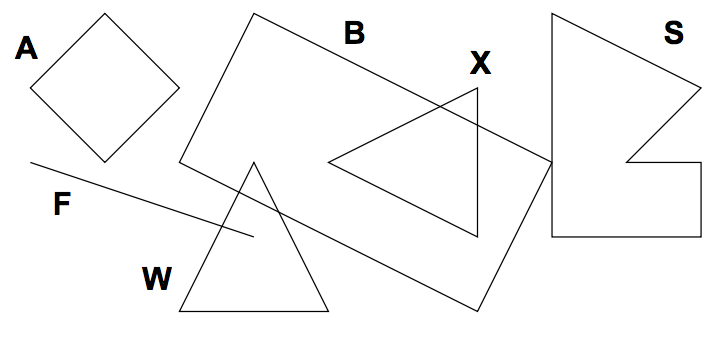

## 문제

While creating a customer logo, ACM uses graphical utilities to draw a picture that can later be cut into special fluorescent materials. To ensure proper processing, the shapes in the picture cannot intersect. However, some logos contain such intersecting shapes. It is necessary to detect them and decide how to change the picture.

Given a set of geometric shapes, you are to determine all of their intersections. Only outlines are considered, if a shape is completely inside another one, it is not counted as an intersection.

## 입력

Input contains several pictures. Each picture describes at most 26 shapes, each specified on a separate line. The line begins with an uppercase letter that uniquely identifies the shape inside the corresponding picture. Then there is a kind of the shape and two or more points, everything separated by at least one space. Possible shape kinds are:

* square: Followed by two distinct points giving the opposite corners of the square.
* rectangle: Three points are given, there will always be a right angle between the lines connecting the first point with the second and the second with the third.
* line: Specifies a line segment, two distinct end points are given.
* triangle: Three points are given, they are guaranteed not to be co-linear.
* polygon: Followed by an integer number N (3 ≤ N ≤ 20) and N points specifying vertices of the polygon in either clockwise or anti-clockwise order. The polygon will never intersect itself and its sides will have non-zero length.

All points are always given as two integer coordinates X and Y separated with a comma and enclosed in parentheses. You may assume that |X|, |Y | ≤ 10000.

The picture description is terminated by a line containing a single dash (“-”). After the last picture, there is a line with one dot (“.”).

## 출력

For each picture, output one line for each of the shapes, sorted alphabetically by its identifier (X). The line must be one of the following:

* “X has no intersections”, if X does not intersect with any other shapes.
* “X intersects with A”, if X intersects with exactly 1 other shape.
* “X intersects with A and B”, if X intersects with exactly 2 other shapes.
* “X intersects with A, B, ..., and Z”, if X intersects with more than 2 other shapes.

Please note that there is an additional comma for more than two intersections. A, B, etc. are all intersecting shapes, sorted alphabetically.

Print one empty line after each picture, including the last one.
