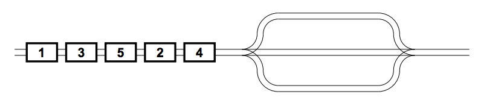
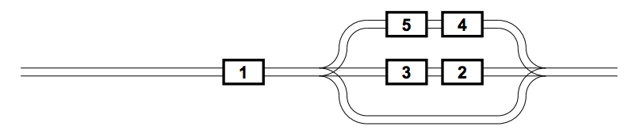

## 문제

ACM has created a new series of huge billboards. Now, they have to be transported using a train. Unfortunately, the carriages of the train get somehow mixed, but ACM wants the billboards to be delivered in an appropriate order.

In a small example, we have 5 carriages approaching a railroad station with 3 parallel tracks. Each carriage may enter any track, but once it is there, it cannot go back anymore. At the other end, the tracks are merged back to a single railroad and cannot go back, again. We want the carriages to leave their tracks in the correct order.

Possible solution is illustrated in the second figure. We may send carriage 4 to the first track, then the carriage number 2 to the second one, number 5 to the first, number 3 to the second, and finally, number 1 to the third track, which may immediately leave it to its correct position. The other carriages will follow as needed.

Your task is to write a program that sends carriages to correct tracks and merges them at the other end. You may assume that the tracks are long enough to hold any number of carriages.

## 입력

The input consists of several scenarios, each of them described on two lines. End of the input is signalized by two zeros.

The first line of each scenario contains two positive integers N and M, separated with a space, N ≤ 200000, M ≤ 200000. N is the number of carriages, M is the number of tracks.

The second line will contain N non-negative integers representing carriages and their intended order on the other end of the station. Some carriages may have identical numbers, in such a case, their mutual order is not significant.

## 출력

For each scenario, output two lines. The first line will contain N numbers, each of them between 1 and M inclusive. Each number corresponds to one carriage (in the order they were given in the input) and determines a track the carriage is to be moved to. The second line also contains N numbers, they specify from what tracks and in which order are the carriages sent to the other end of the station.

If carriages are manipulated according to your answer, they must leave the station in a nondescending order. When there are more solutions, you may print any of them. If there is no solution, print only one line containing the words “Transportation failed”.
