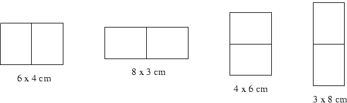

## 문제

ACM managers need business cards to present themselves to their customers and partners. After the cards are printed on a large sheet of paper, they are cut with a special cutting machine. Since the machine operation is very expensive, it is necessary to minimize the number of cuts made. Your task is to find the optimal solution to produce the business cards.

There are several limitations you have to comply with. The cards are always printed in a grid structure of exactly a x b cards. The structure size (number of business cards in a single row and column) is fixed and cannot be changed due to a printing software restrictions. The sheet is always rectangular and its size is fixed. The grid must be perpendicular to the sheet edges, i.e., it can be rotated by 90 degrees only. However, you can exchange the meaning of rows and columns and place the cards into any position on the sheet, they can even touch the paper edges.

For instance, assume the card size is 3 x 4 cm, and the grid size 1 x 2 cards. The four possible orientations of the grid are depicted in the following figure. The minimum paper size needed for each of them is stated.

The cutting machine used to cut the cards is able to make an arbitrary long continuous cut. The cut must run through the whole piece of the paper, it cannot stop in the middle. Only one free piece of paper can be cut at once -- you cannot stack pieces of paper onto each other, nor place them beside each other to save cuts.

## 입력

The input consists of several test cases. Each of them is specified by six positive integer numbers, A,B,C,D,E,F, on one line separated by a space. The numbers are:

* A and B are the size of a rectangular grid, 1  <= A,B  <= 1 000,
* C and D are the dimensions of a card in cms, 1  <= C,D  <= 1 000, and
* E and F are the dimensions of a paper sheet in cms, 1  <= E,F  <= 1 000 000.

The input is terminated by a line containing six zeros.

## 출력

For each of the test cases, output a single line. The line should contain the text: "The minimum number of cuts is X.", where X is the minimal number of cuts required. If it is not possible to fit the card grid onto the sheet, output the sentence "The paper is too small." instead.
