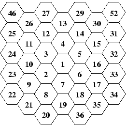

## 문제

Finding the shortest route is the typical task of a truck driver. If the truck moves via the shortest route, it saves money. It is also important to know alternative routes of the same length, for the case a route is unavailable, e.g., due to some road work.

To describe a region, we need to model a map of it. ACM recently found that triangular and rectangular based models are insufficient and decided to use hexagons for describing maps. Given a regular hexagonal grid (like honeycombs), we can number the cells starting with 1 (in any particular cell) and going in a spiral-like manner to other cells. This way, each cell is uniquely identified by its number and vice versa, each positive integer identifies a single cell.

Two cells are called neighboring iff they have one side in common. In an infinite structure, each cell has exactly six neighbors. For instance, cell number 2 neighbors to cells 1, 3, 7, 8, 9 and 10. A hexagonal route is a non-empty sequence of cells where each cell in the sequence (except the last one) neighbors with its successor. A hexagonal route between two cells X and Y is a hexagonal route with X being the first member of the sequence, and Y being the last. The length of the route is the number of cells minus one. It represents the number of steps we need to make to travel via the route.

Your task is to determine the length of the shortest possible route between two cells and the total number of mutually different routes of that length. Different routes must differ in at least one sequence member, i.e., they do not need to form completely disjoint sequences.

## 입력

The input consists of a series of tasks, each of them given on one separate line. The line contains two integer numbers X and Y, separated by a space, 1  <= X, Y  <= 1 000 000, X <> Y. These numbers identify two different cells. The last task is followed by a line containing two zeros. This line terminates the input.

## 출력

For each task, output the sentence "There are N routes of the shortest length L.". Replace L with the smallest possible route length between cells X and Y. Replace N with the number of different routes of that length. If there is a single route only, use the words "is" and "route" instead of "are" and "routes".
