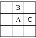

## 문제

According to a usually reliable source (that does not want to be published), the dangerous anarchist group New Tomorrow (aka NT 2000) prepares a frontal attack against the Congress Center. The anarchists had big troubles choosing the proper moment to begin with their attack. Finally, they have agreed upon to let the fortune decide. They are going to play dice (which is, moreover, good thing to have fun while waiting for the action) and when six dots appear on the top side of all dice, it is the signal to begin the attack.

The police knows that and they want to be informed about the signal. Fortunately, the area around the Congress Center is monitored with cameras. Thus, the police can have the picture of the anarchists in any given moment during their play. To automate the processing, they need a program that gets the bitmap image and determines the outcome of the throw that has just been performed, i.e., the the number of dots visible on each die.

We make the following assumptions about the input images. The images contain only three different pixel values: for the background, the dice and the dots on the dice. We consider two pixels connected if they share an edge -- meeting at a corner is not enough. In the figure, pixels A and B are connected, but B and C are not.

A set S of pixels is connected if for every pair a,b of pixels in S, there is a sequence a1, a2, ... ak in S such that a = a1, b = ak, and for any 1 <= i < l, ai and ai+1 are connected.

We consider all maximally connected sets consisting solely of non-background pixels to be dice. "Maximally connected" means that you cannot add any other non-background pixels to the set without making it disconnected. Likewise, we consider every maximal connected set of dot pixels to form a dot.

## 입력

The input consists of pictures of several dice throws. Each picture description starts with a line containing two numbers H and W, the height and width of the picture, respectively, 1 <= W,H <= 500.

The following H lines contain W characters each. The characters can be: dot (".") for a background pixel, asterisk ("\*") for a pixel of a die, and "X" for a pixel of a die's dot. The picture will contain at least one die, and the numbers of dots per die is between 1 and 6, inclusive. The maximal number of dice in the picture is limited only by its size.

Dice and dots may have different sizes and may not be entirely square due to optical distortion. In fact, they can have arbitrary shape, as far as they remain connected. Anyway, you can assume the dice cannot be "hollow", i.e., if we consider all the pixels outside the picture to be background, all background pixels are connected.

The input is terminated by a picture starting with w = h = 0, which should not be processed.

## 출력

For each throw of dice, output a single line containing the text "Throw:" followed by a space and the number of dots on all the dice in the picture, sorted in increasing order. Numbers should be separated with a single space.
