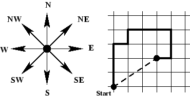

## 문제

The Prague citizens are preparing for the Summit too. Most importantly, they must be prepared for limited possibilities of movement through the city. The Home Affairs Department issued ten recommendations how to behave (so called "decalogue"). One of these points says to obey the directions of the police, even if they recommend more complicated routes to the place a person wants to walk to.

The directions describing the route usually tell us something like "Start at this corner. Take three steps towards the tall chimney, then seventeen steps towards the small maple tree, ... blah blah ..., finally six steps towards the graffiti painting. Then you will be there." Most of these directions just boil down to taking the mentioned number of steps in one of the eight principal compass directions (depicted in the figure).

Obviously, following the paths given by the police may lead to an interesting tour of the local scenery, but if one is in a hurry, there is usually a much faster way: just march directly from your starting point to the place where you want to go. Instead of taking three steps north, one step east, one step north, three steps east, two steps south and one step west (see figure) following the direct route (dashed line in figure) will result in a path of about 3.6 steps.

You are to write a program that computes the location of and distance to the target place, given a recommended route.

Disclaimer: Note that this contest problem assignment is not a challenge to violate the police recommendations! We take no responsibility for any improper use of the program.

## 입력

The input file contains several strings, each one on a line by itself, and each one consisting of at most 200 characters. The last string will be "END", signaling the end of the input. All other strings describe one route, according to the following format:

The description is a comma-separated list of pairs of lengths (positive integers less than 10000) and directions: "N" (north), "NE" (northeast), "E" (east), "SE" (southeast), "S" (south), "SW" (southwest), "W" (west), or "NW" (northwest). For example, "3W" means 3 steps to the west, and "17NE" means 17 steps to the northeast. A fullstop (".") terminates the description, which contains no blanks.

## 출력

For every map description in the input, output a single line containing the sentence "You can go to (X,Y), the distance is D steps." where X and Y are the absolute coordinates of the target point of the route. The coordinate system is oriented such that the x-axis points east, and the y-axis points north. The path always starts at the origin (0,0). The fractional values X, Y, and D must be printed exact to three digits to the right of the decimal point.
