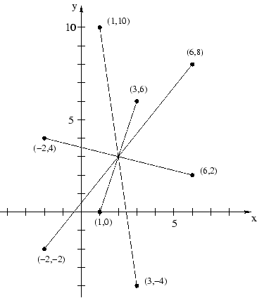

## 문제

The representatives of NATO countries must be guarded by many bodyguards during the Summit. Each V.I.P. is accompanied by his own bodyguards but is also assigned many other specialists, snipers, etc. To make their work efficient and the guarded person secure as much as possible, the bodyguards must be distributed to various directions from the person.

The optimal placement of bodyguards is such that the V.I.P. stands in the center of symmetry of all guards. Unfortunately, when the V.I.P. moves, it is very hard to reconfigure the bodyguards' positions to reflect the new situation. Most of the Czech specialists are not able to do such reconfigurations in real-time.

Therefore, the Home Affairs Minister Sobeslav Gros has decided to reverse this procedure. The bodyguards take their places first. Then, it is the responsibility of the V.I.P. to find the proper position in the center of symmetry. If the person appears anywhere else, we take no responsibility for his/her security.

Your task is to automate the process. Given a set of N points (bodyguard positions), you are to find its center of symmetry S, where the V.I.P. is relatively safe. More formal description follows.

Let's have a point A and the center of symmetry S. We say that another point A' is the image of the point A according to the center of symmetry S iff S is the center of the line joining points A and A'.

The image of the set of points (X) according to the center S is the set of all images of individual points in that set. The set X is said to possess a center of symmetry, if there exists a point S such that the image of the set X according to the center S is equal to the set X itself.

## 입력

The input consists of several assignments. Each assignment begins with a line containing a single integer number N, 1 <= N <= 20000. It is followed by N lines, each containing two integer numbers Xi and Yi separated with a space, -105 <= |Xi,Yi| <= 105. These are the Cartesian coordinates of the i-th point in the set.

Since no two bodyguards occupy the same place, no point will appear twice in the same assignment. However, note that a bodyguard can be in the same place as the V.I.P.

After the last assignment, there is a line containing zero instead of the number of points. This line should not be processed.

## 출력

For each assignment, output exactly one line. If the given set possesses a center of symmetry, print the text "V.I.P. should stay at (X,Y)." where X and Y are the Cartesian coordinates of the center rounded to the nearest number with exactly one digit after the decimal point.

If there is no center of symmetry, output the text: "This is a dangerous situation!".
