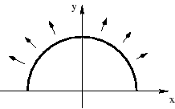

## 문제

Fred Mapper is a real estate agent in Prague. Many foreign delegates participating in NATO Summit ask him to find some house for them, because they want to rent it during their stay in Prague. Some even plan to stay here for a longer time after the Summit ends. Unfortunately, many of them saw the pictures on TV showing the floods that happened in August, and are afraid of water.

Many of Fred's properties are located in Kampa. In the process of investigating the August data, he learned that in the case of flooding, the water covers exactly 50 square meters each hour. Now we need to know how much time is available for evacuation in any given point.

After doing more research, Fred has learned that the land that is being flooded forms a semicircle. This semicircle is part of a circle centered at (0,0), with the line that bisects the circle being the x-axis. Locations below the x-axis are in the river. The semicircle has an area of 0 at the beginning of hour 1 (when the flood begins). The semicircle is illustrated in the Figure.

## 입력

The line consists of several property descriptions. Each property is described by one line containing two numbers X and Y which are the Cartesian coordinates of the property. X and Y are floating point numbers measured in meters and given with one digit after the decimal point, -1000 <= X <= 1000, 0 <= Y <= 1000.

The point (0,0) will not be given with the exception of the last line, where two zeros are given to terminate the input. This last line should not be processed.

## 출력

For each property, a single line of output should appear. This line should take the form of "The property will be flooded in hour Z." where Zis the first hour (counted from 1) this property will be within the semicircle at the end of hour Z. Z must be an integer. No property will appear exactly on the semicircle boundary at the end of any hour, it will either be inside or outside.
