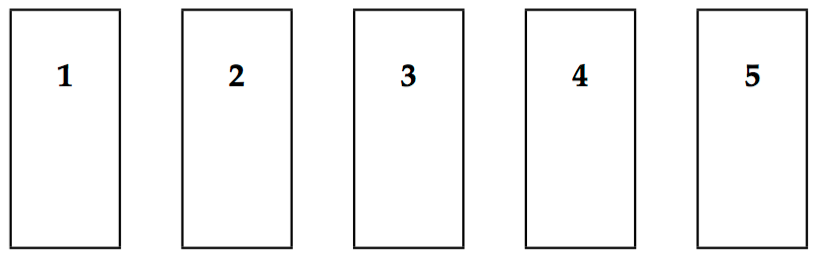

## 문제

In a corridor in a student dormitory, there are five rooms numbered **1, 2, 3, 4** and **5**; room number **1** is the left-most room. The rooms have doors in different colours: **blue, green, red, white** and **yellow**, but not necessarily in that order.

In these rooms live five students **Anna, Bernhard, Chris, David** and **Ellen** of five different nationalities **Danish, Finnish, Icelandic, Norwegian** and **Swedish**. (Both the names and the nationalities are given in alphabetical order, so it does not follow automatically that Anna is Danish.)

These students have one computer each, and these computers are of different kinds: **Amiga, Atari, Linux, Mac** and **Windows** (given here in alphabetical order). They each have their own favourite programming language: **C, C++, Java, Pascal** and **Perl** (also listed in alphabetical order).

You want to find out who owns the Amiga computer based on some facts about the students.

## 입력

The input consists of several scenarios. The first input line contains a number 1–1000 indicating how many scenarios there are.

Each scenario starts with a line with a number 1–2000 telling how many fact lines there are for that scenario. Then follow the fact lines which each contains three words separated by one or more spaces:

* The first and third word is one of these names:

**12345  
blue green red white yellow anna bernhard chris david ellen  
danish finnish icelandic norwegian swedish   
amiga atari linux mac windows  
c c++ java pascal perl**

(Note that no uppercase letters are used.)

* The second word specifies a relationship; it is one of

**same-as left-of right-of next-to**

**same-as** tells that the first and third fact words apply to the same  
room; for instance

blue same-as bernhard

tells that Bernhard lives in the room with a blue door.

**left-of** tells that the first fact word applies to the room immediately to the left of the one to which the third fact word applies. For example,

chris left-of perl

means that Chris lives in the room immediately to the left of the Perl programmer.

**right-of** tells that the first fact word applies to the room immediately to the right of the one to which the third fact word applies.

**next-to** tells that the two fact words apply to rooms next to each other. For example,

swedish next-to linux

means that the Swedish student lives in the next room (either to the left or the right) of the owner of the Linux computer.

You may assume that there are no inconsistencies in the input data. In other words, there will in every scenario be at least one person who may own the Amiga without violating the constraints.

## 출력

For each scenario, you should print a line starting with

scenario #n:

where n is the scenario number. If you can determine who (i.e., Anna, Bernhard, Chris, David or Ellen) owns the Amiga, you continue the line with

xxxx owns the amiga.

or, if you cannot name the Amiga owner, you print

cannot identify the amiga owner.
