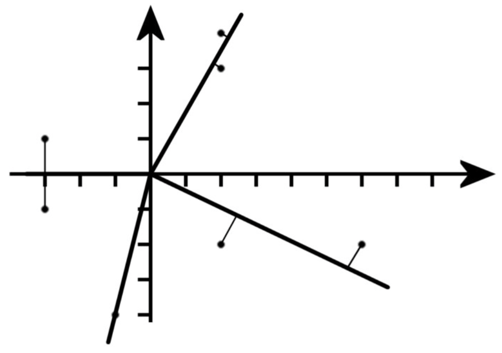

## 문제

The government in a foreign country is looking into the possibility of establishing a subway system in its capital. Because of practical reasons, they would like each subway line to start at the central station and then go in a straight line in some angle as far as necessary. You have been hired to investigate whether such an approach is feasible. Given the coordinates of important places in the city as well as the maximum distance these places can be from a subway station (possibly the central station, which is already built), your job is to calculate the minimum number of subway lines needed. You may assume that any number of subway stations can be built along a subway line.

Figure 1: The figure above corresponds to the first data set in the example input.

## 입력

The first line in the input file contains an integer N, the number of data sets to follow. Each set starts with two integers, n and d (1 ≤ n ≤ 500, 0 ≤ d ≤ 150). n is the number of important places in the city that must have a subway station nearby, and d is the maximum distance allowed between an important place and a subway station. Then comes n lines, each line containing two integers x and y (-100 ≤ x, y ≤ 100), the coordinates of an important place in the capital. The central station will always have coordinates 0, 0. All pairs of coordinates within a data set will be distinct (and none will be 0, 0).

## 출력

For each data set, output a single integer on a line by itself: the minimum number of subway lines needed to make sure all important places in the city is at a distance of at most d from a subway station.
