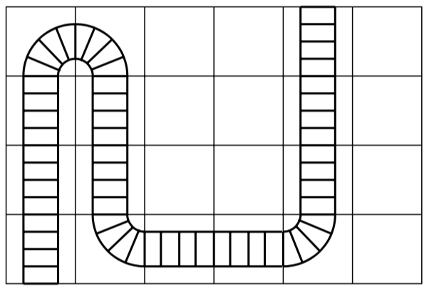

## 문제

John is a model railroad enthusiast. He enjoys these railroads so well that he wants to build them as long as possible. He also wants to meet other model railroad devotees and run their trains. To make it simple to transport his railroad and connect to various other railroads, each owner builds his railroad in modules. These modules are in specific sizes and designed to be easy to fit together.

John only builds rectangular modules. Every module has two connection points on the edge onto which other modules may be connected. In every module, the model railroad shall run between the two connection points, and the railroad must begin and end perpendicular to the wall at the connection points. To avoid too complex situations, John uses only straight rails and curved rails with a 90° bend. (A curved rail may be used to make either a left or a right turn.) A rail occupies an area of 10 × 10 centimeters whether the rail is curved or straight.

John want to design his railroads so that the track is as long as possible given the number of rails he has available. To achieve this, he wants to write a computer program that calculates how many rails he may use in a module.

An solution for a 6 × 4 module starting in (1, 1) and ending in (5, 4) when John has 15 straight and 5 curved railroad tracks.

## 입력

The first input line specifies how many modules that are to be built. For every module the following information is given:

1. First comes a line stating the size of the module. This is given as two integers specifying the width and depth of the module, given as multiples of 10 centimeters. The values will always be less than or equal to 10.
2. The next line contains the connection points for the module. These connections are always along the bottom and top row, respectively. The positions are given as the x-coordinates of the connection points and are integers in the range 1 to maximum x-coordinate.
3. The last line specifies how many straight rails and how many curved rails are available for the module.

## 출력

The answer shall be how long the longest legal railroad can be. If it is impossible to build a railroad, you should state this.
