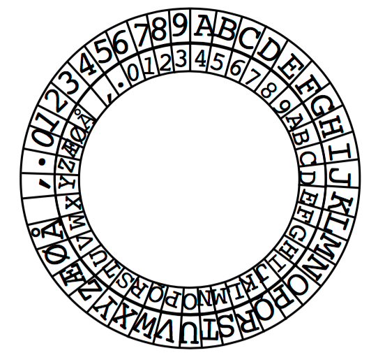

## 문제

Tommy og Tigeren har en hemmelig klubb: R.Ø.L.P. («Resirkuler Øyeblikkelig Lusete Piker»). Hensikten med klubben er å bekjempe erkefienden Susanne og gjøre livet hennes mest mulig miserabelt. Som alle hemmelige klubber har R.Ø.L.P. et hemmelig klubbhus, et hemmelig passord, en hemmelig sang som alle medlemmene må kunne, hemmelig medlemsliste osv. For å unngå at Susanne finner ut hvilke planer de eminente medlemmene av R.Ø.L.P. legger for henne, har klubben også en hemmelig kode. Koden brukes for å kode (kryptere) alle planer når de skal skrives ned. De krypterte meldingene oppbevares på et sikkert sted (i klubbhuset) hvor Susanne aldri vil finne på å lete.

Den hemmelige koden er basert på et kodehjul som fulgte med en pakke med Tommys favorittfrokostblanding «Super Sukrede Choko Bomber». Siden medlemmene av R.Ø.L.P. kjenner til Susannes usedvanlig prektige og kjedelige spisevaner regner de det som helt usannsynlig at hun noen gang skal få tak i et tilsvarende kodehjul.

Kodehjulet består av et ytre fast hjul der alle tegn som kan brukes i koden er skrevet langs hjulets kant. Først står boktavene A til Å fortløpende etterfulgt av tegnene mellomrom, komma og punktum. Til sist står tallene 0–9. Innenfor det faste hjulet er det et mindre bevegelig hjul som inneholder akkurat de samme tegnene slik at de passer mot det ytre hjulet. For å kode en melding vrir man det indre hjulet til en vilkårlig posisjon. Hvert tegn i meldingen lokaliseres på det ytre hjulet og erstatter med tegnet rett innenfor på det indre hjulet. Tilsvarende når man skal dekode en melding så må man først vite hvilken posisjon det indre hjulet skal stå i, og så finner man hvert tegn fra den krypterte meldingen på det indre hjulet og bytter med tegnet rett utenfor på det ytre hjulet.

Slik hjulet i figuren er satt vil teksten

    TOMMY OG TIGEREN

bli kodet som

    NIGGSXIAXNCA8L8H

Dessverre for medlemmene i R.Ø.L.P. har Susanne begynt å interessere seg for hva Tommy og Tigeren driver på med. Etter litt elementær etteretningsvirksomhet har hun funnet frem til det hemmelige klubbhuset og der har hun også funnet og skrevet av alle de hemmelige planene (i kodeform). Som om ikke det var ille nok er det samme firma som produserer «Super Sukrede Choko Bomber» som produserer Susannes favorittfrokostblanding «Havre og Fiber». For å gjøre produktet mer salgbart har de lagt i et tilsvarende kodehjul i frokostblandingen som det R.Ø.L.P. bruker.

Nå har Susanne alt det hun trenger for å avsløre de hemmelige planene. Hun må bare finne ut hvordan hun skal dekode hver melding. Som god hobbydetektiv har hun gjettet at bokstavkombinasjonen «RØLP» forekommer med stor sannsynlighet i hver melding. Siden du er «dataekspert» vil Susanne gjerne at du skriver et program som automatisk dekoder og skriver ut en kryptert melding i klartekst. Du vet at du har dekodet en melding rett dersom du får frem bokstavkombinasjonen «RØLP». Dersom du ikke finner en dekoding som gir «RØLP» skal du gi beskjed om det. Merk at det kan finnes flere dekodinger av en melding. Da skal du gi hver mulig dekoding og så får det være opp til Susanne å avgjøre hvilken som er rett.

## 입력

Den første linjen i input sier hvor mange kodemeldinger det er. For hver kodemelding er det først en linje med et tall (max 200) som sier hvor mange tegn meldingen består av. Kodemeldingen følger så på neste linje.

## 출력

For hver kodemelding gi nummeret til meldingen på en egen linje. For hver mulig dekoding skal du skrive ut den dekodete teksten. Dersom det er flere måter å dekode en melding skal du skrive ut alle alternativene. Dersom det ikke er noen måte å dekode meldingen på skal du gi beskjed om det.
