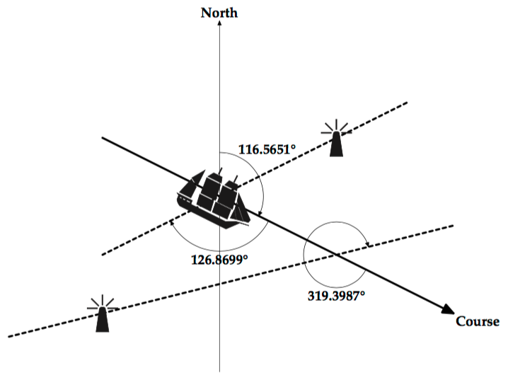

## 문제

A boat with a directional antenna can determine its present position with the help of readings from local beacons (radio transmitters). Each beacon is located at a known position and emits a unique signal. When a boat detects a signal, it rotates its antenna until the signal is at maximal strength. This gives a relative bearing to the position of the beacon. Given a previous beacon reading (the time, the relative bearing, and the position of the beacon), a new beacon reading is usually sufficient to determine the boat’s present position. You are to write a program to determine, when possible, boat positions from pairs of beacon readings.

For this problem, the positions of beacons and boats are relative to a rectangular coordinate system. The positive x-axis points east; the positive y-axis points north. The course is the direction of travel of the boat and is measured in degrees clockwise from north. That is, north is 0°, east is 90°, south is 180°, and west is 270°. The relative bearing of a beacon is given in degrees clockwise relative to the course of the boat. A boat’s antenna cannot indicate on which side the beacon is located. A relative bearing of 90° means that the beacon is toward 90° or 270°.

## 입력

The first line of input is an integer specifying the number of beacons (at most 30). Following that is a line for each beacon. Each of those lines begins with the beacon’s name (a string of 20 or fewer alphabetical characters), the x-coordinate of its position, and the y-coordinate of its position. These fields are single-space separated.

Coming after the lines of beacon information is an integer specifying a number of boat scenarios to follow. A boat scenario consists of three lines, one for velocity and two for beacon readings.

|  |  |
| --- | --- |
| Data | Meaning |
| course speed | the boat’s course and the speed at which it is traveling |
| time1 name1 angle1 | time of first reading, name of first beacon, relative bearing of first beacon |
| time2 name2 angle2 | time of second reading, name of second beacon, relative bearing of second beacon |

All times are given in minutes since midnight measured over a single 24-hour clock. The speed is the distance (in units matching those of the rectangular coordinate system) per minute. The second line of the scenario gives the first beacon reading as the time of the reading (an integer), the name of the beacon, and the angle of the reading as measured from the boat’s course. These 3 fields have single space separators. The third line gives the second beacon reading. The time for that reading will always be at least as large as the time for the first reading.

## 출력

For each scenario, your program should print the scenario number (Scenario 1, Scenario 2, etc.) and a message indicating the position (rounded to 2 decimal places) of the boat as of the time of the second reading. If it is impossible to determine the position of the boat, the message should say

    Position cannot be determined
