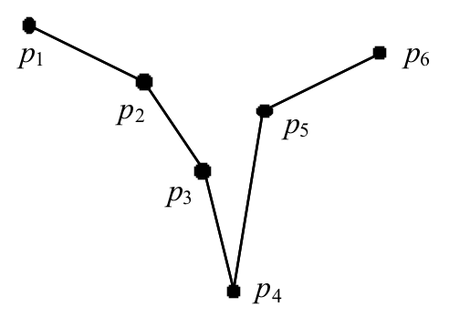

## 문제

Gheeves (plural of gheef) are some objects similar to funnels. We define a gheef as a two dimensional object specified by a sequence of points (*p*1, *p*2, ..., *pn*) with the following conditions:

* 3 ≤ *n*  ≤ 1000
* If a point *pi* is specified by the coordinates (*xi*, *yi*), there is an index 1 < *c* < *n* such that *y*1 > *y*2 > ... > *yc* and  
  *yc < yc*+1 < *yc*+2 < ... < *yn*. *pc* is called the cusp of the gheef.
* For all 1  ≤ *i* < *c*, *xi* < *xc* and for all *c* < *i*  ≤ *n*, *xi* > *xc*.
* For 1 < *i* < *c*, the amount of rotation required to rotate *pi*-1 around *pi* in clockwise direction to become co-linear with *pi* and *pi*+1, is greater than 180 degrees. Likewise, for *c* < *i* < *n*, the amount of rotation required to rotate  
  *pi*-1 around *pi* in clockwise rotation to become co-linear with *pi* and *pi*+1, is greater than 180 degrees.
* The set of segments joining two consecutive points of the sequence intersect only in their endpoints.

For example, the following figure shows a gheef of six points with *c* = 4:

We call the sequence of segments (*p*1*p*2, *p*2*p*3, ..., *pn*-1*p*n), the body of the gheef. In this problem, we are given two gheeves *P* = (*p*1, *p*2, ..., *pn*) and *Q* = (*q*1, *q*2, ..., *qm*), such that all *x* coordinates of *pi* are negative integers and all *x* coordinates of *qi* are positive integers. Assuming the cusps of the two gheeves are connected with a narrow pipe, we pour a certain amount of water inside the gheeves. As we pour water, the gheeves are filled upwards according to known physical laws (the level of water in two gheeves remains the same). Note that in the gheef *P*, if the level of water reaches *min*(*y*1, *yn*), the water pours out of the gheef (the same is true for the gheef *Q*). Your program must determine the level of water in the two gheeves after pouring a certain amount of water. Since we have defined our problem in two dimensions, the amount of water is measured in terms of area it fills. Note that the volume of pipe connecting cusps is considered as zero.

## 입력

The first number in the input line, *t* is the number of test cases. Each test case is specified on three lines of input. The first line contains a single integer *a* (1 ≤ *a* ≤ 100000) which specifies the amount of water poured into two gheeves. The next two lines specify the two gheeves *P* and *Q* respectively, each of the form *k  x1 y1  x2 y2 ... xk yk*  where *k* is the number of points in the gheef (*n* for *P* and *m* for *Q*), and the *xi yi*  sequence specify the coordinates of the points in the sequences.

## 출력

The output contains *t* lines, each corresponding to an input test case in that order. The output line contains a single integer *L* indicating the final level of water, expressed in terms of *y* coordinates rounded to three digits after decimal points.
