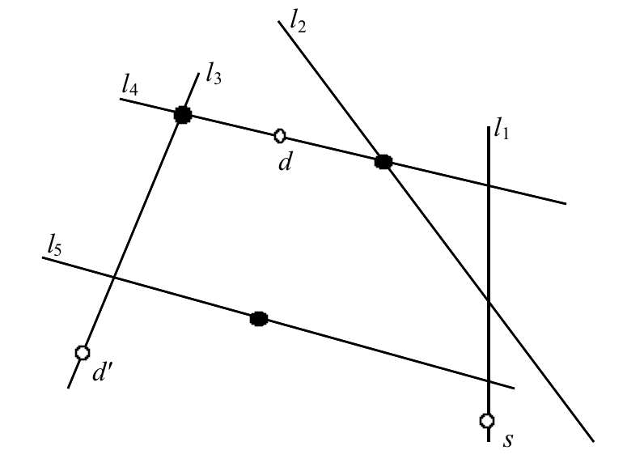

## 문제

ACM is a town with a very special underground metro system which consists of a set of railway segments, each is called a line. There are trains in both directions of each line. Two lines may intersect which allows a passenger to switch from one train in the first line to another train in the second line on that intersection. The source and  destination of your travel lie somewhere on the metro lines. You start using the metro line where the source is located on and may change your line only at the intersection points between two metro lines, and continue until your reach the destination. Your goal is to make your travel free of charge; i.e., without the need to buy any tickets. The problem is that there are a number of policemen who check your tickets. Obviously, you do not want to confront with any of these policemen during your travel. You may confront policemen in two situations: either on an intersection, but only when you are changing your line, or when you are traveling along a line in which a policeman indiscriminately asks for everyone’s tickets that are inside that wagon, including you. You know the locations of all policemen in advance. Note that if a police is located on an intersection, he asks for your ticket only if you want to change your line on that intersection, and if a police is located on a line (but not on an intersection), he will ask for your ticket if you are passing that location. In your map, there are some policemen in other locations, not on any metro lines, which you must ignore.

For example, in the following figure, there are five metro lines, with three policemen located at black circles. You may travel from *s* to *d* without meeting any police along the path *l*1 -- *l*4, but it is not possible to travel from *s* to *d'* without confronting any policemen.

In this problem, you must write a program that reads the metro line specifications, the police locations, and your source and destination, and determine whether it is possible to travel from the given source to the given   destination without meeting any policeman.

## 입력

The first number in the input line, *T* is the number of test cases. The first line of each test case contains two integers *n* and *m* (1 ≤ *m* ≤ 100, 1 ≤ *n* ≤ 3000) which are the number of lines and the number of policemen. The second line contains four integers *xs  ys  xd  yd*  which are the coordinates of the source and the destination points respectively. You may assume these two points lie on metro lines. Following the second line, there are *n* lines of the form *x*1 *y*1 *x*2 *y*2 describing the metro lines where (*x*1, *y*1) and (*x*2, *y*2) specify the endpoints of the metro line. After this, there are *m* lines each containing a pair of integers *x* *y* that specify the location of a policeman. All coordinates are arbitrary integer numbers.

## 출력

The output contains *T* lines, each corresponding to an input test case in that order. The output line contains a single word YES or NO depending on whether there is a safe way to travel from source to destination or not.
