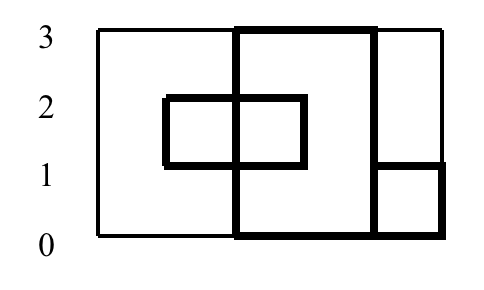

## 문제

In the small historical village of Basinia, there is a popular activity in wedding ceremonies called *rectangle cutting*. During this activity, each close relative of the bride comes and cuts a rectangle in the wedding cake (but does not take a piece). The cake has a rectangular shape. The problem is to count how many pieces are in the cake after rectangle-cutting.

For example, in the following figure, the cake size is 3×5, and three people have made rectangular cuts in it. As a result, the cake is cut into six pieces.

Each rectangular cut is specified by the (*x*,*y*) coordinates of its two opposite corners. The input for the above figure can be found in the first sample input. As there are large families in Basinia, the number of pieces may be large and we need a computer program to compute it.

## 입력

The input contains several test cases. Each test has several lines. The first line has two integers *w* (1 ≤ *w* ≤ 20) and *h* (1 ≤ *h* ≤ 20) which are the width and height of the cake. The second line contains a single integer n (0 ≤ *n* ≤ 50) which is the number of people who cut rectangles in the cake. After this, there are *n* lines each containing the integers *x*1, *y*1, *x*2, *y*2 which are the coordinates of two opposite corners of the cut. You may assume 0 ≤ *x*1, *x*2 ≤ *w* and 0 ≤ *y*1, *y*2 ≤ *h*. The last line of the input is a line containing two zeros.

## 출력

For each test case, write the number of pieces the cake is cut into.
