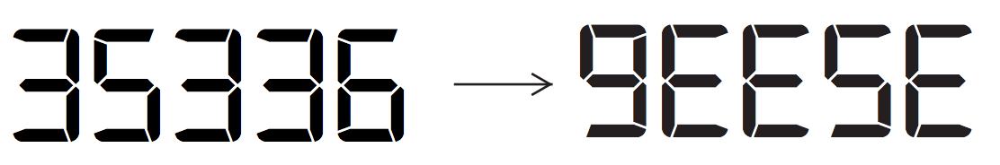

## 문제

In Waterloo, you probably have seen some geese. How can you see geese with your calculator? Start with 6, add 7, multiply by 6, multiply by 8, add 7, multiply by 8, and multiply by 7, giving 35336. Then if you flip your calculator upside down, it says gEESE:

You want to write a program to help automatically build tricks of this type. However, your calculator has a lot of broken buttons: the only mathematical operators that work are + and ×, and only a few of the digits work. Your goal is to figure out whether your half-broken calculator can achieve a given target value, using single-digit inputs and a fixed number of operations.

Note: the calculator performs the operations as soon as they are entered, rather than following any rules for order of operations (see Sample Input 2).

## 입력

The first line of input is W, the exact number of operations you must use. W will be an integer between 0 and 6. The second line of input is 1 ≤ D ≤ 10, the number of working digit keys. On each of the D following lines, a working digit is given; these values are distinct integers from 0 to 9. Finally, an integer 1 ≤ V ≤ 5 is given, the number of target values; on each of the following V lines there is an integer between 0 and 5000000 (inclusive) giving a target value which you’d like to achieve on your calculator.

## 출력

The output consists of V lines corresponding to the target values; each line contains “Y” if that target value can be achieved, and “N” if it cannot be achieved, using exactly W operations with the D given digits.

Precisely, a target value T can be achieved if, starting with one of the D digits, and then by adding or multiplying exactly W times by one of the digits, you end up with T. Digits can be re-used, and you do not need to use all of the digits. You cannot enter multi-digit numbers.
