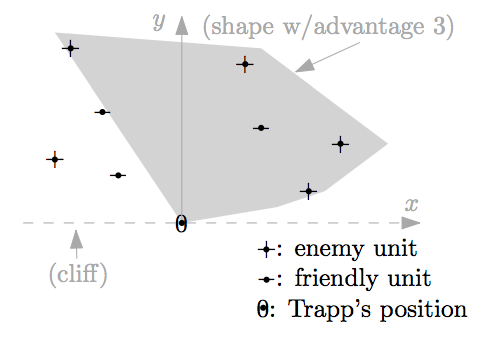

## 문제

Colonel Trapp is trapped! For several days he has been fighting General Position on a plateau and his mobile command unit is now stuck at (0, 0), on the edge of a cliff. But the winds are changing! The Colonel has a secret weapon up his sleeve: the “epsilon net.” Your job, as the Colonel’s chief optimization officer, is to determine the maximum advantage that a net can yield.

The epsilon net is a device that looks like a parachute, which you can launch to cover any convex shape. (A shape is convex when, for every pair p, q of points it contains, it also contains the entire line segment pq.) The net shape must include the launch point (0, 0).

The General has P enemy units stationed at fixed positions and the Colonel has T friendly units. The advantage of a particular net shape equals the number of enemy units it covers, minus the number of friendly units it covers. The General is not a unit.

You can assume that

* no three points (Trapp’s position (0, 0), enemy units, and friendly units) lie on a line,
* every two points have distinct x-coordinates and y-coordinates,
* all co-ordinates (x, y) of the units have y > 0,
* all co-ordinates are integers with absolute value at most 1000000000, and
* the total number P + T of units is between 1 and 100.

## 입력

The first line contains P and then T, separated by spaces. Subsequently there are P lines of the form xy giving the enemy units’ co-ordinates, and then T lines giving the friendly units’ coordinates.

## 출력

Output a single line with the maximum possible advantage.

## 힌트

Figure 1: Sample input and an optimal net
