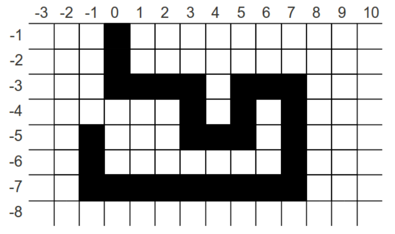

## 문제

Boring is a type of drilling, specifically, the drilling of a tunnel, well, or hole in the earth. With some recent events, such as the Deepwater Horizon oil spill and the rescue of Chilean miners, the public became aware of the sophistication of the current boring technology. Using the technique known as geosteering, drill operators can drill wells vertically, horizontally, or even on a slant angle.

A well plan is prepared before drilling, which specifies a sequence of lines, representing a geometrical shape of the future well. However, as new information becomes available during drilling, the model can be updated and the well plan modified.

Your task is to write a program that verifies validity of a well plan by verifying that the borehole will not intersect itself. A two-dimensional well plan is used to represent a vertical cross-section of the borehole, and this well plan includes some drilling that has occurred starting at (0, −1) and moving to (−1, −5). You will encode in your program the current well plan shown in the figure below:

## 입력

The input consists of a sequence of drilling command pairs. A drilling command pair begins with one of four direction indicators (`d` for down, `u` for up, `l` for left, and `r` for right) followed by a positive length. There is an additional drilling command indicated by `q` (quit) followed by any integer, which indicates the program should stop execution. You can assume that the input is such that the drill point will not:

* rise above the ground, nor
* be more than 200 units below ground, nor
* be more than 200 units to the left of the original starting point, nor
* be more than 200 units to the right of the original starting point

## 출력

The program should continue to monitor drilling assuming that the well shown in the figure has already been made. As we can see (−1, −5) is the starting position for your program. After each command, the program must output one line with the coordinates of the new position of the drill, and one of the two comments `safe`, if there has been no intersection with a previous position or `DANGER` if there has been an intersection with a previous borehole location. After detecting and reporting a self-intersection, your program must stop.
