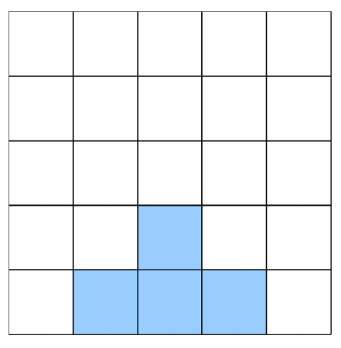
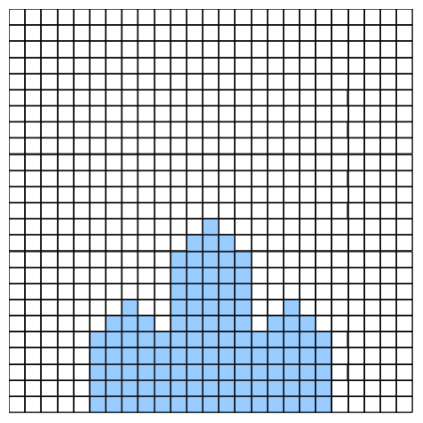

## 문제

Alice is looking at a crystal through a microscope. Alice’s microscope has the interesting feature that it can superimpose grid lines over the image that she is looking at.

At level 1 of magnification, Alice sees the image as follows:

Notice that at level 1, there is a 5 × 5 grid superimposed over the image.

However, as Alice increases the magnification, the leaf pattern becomes more intricate.

At level 2 of the magnification, Alice sees the image with a 25 × 25 grid, and notices that three of the four larger squares in the original image have the small four square pattern on top. In fact, for this particular crystal, this self-similarity repeats for each magnification level.

Given that Alice’s microscope has up to 13 levels of magnification, she would like to try to quantify the detail of each grid cell at every one of these magnification levels.

Specifically, since there is a 5m × 5m grid at magnification level m, Alice will call the bottom-left corner grid cell (0, 0), the bottom-right grid cell (5m − 1, 0), the top-left grid cell (0, 5m − 1), and the top-right grid cell (5m − 1, 5m − 1).

Given an integer magnification level m (1 ≤ m ≤ 13) and a grid position (x, y) (where 0 ≤ x < 5m and 0 ≤ y < 5m), Alice would like to know if her crystal will fill that grid cell, or if that grid cell will be empty space.

## 입력

The first line of input will be T (0 < T ≤ 10) which is the number of test cases. On each of the next T lines there will be three integers: m, the magnification level, followed by x and y, the position of the grid cell that Alice wishes to examine.

## 출력

The output will be T lines. Each line of output will either be `empty`, if the specified grid cell is empty, or `crystal` if that grid cell contains crystal.
