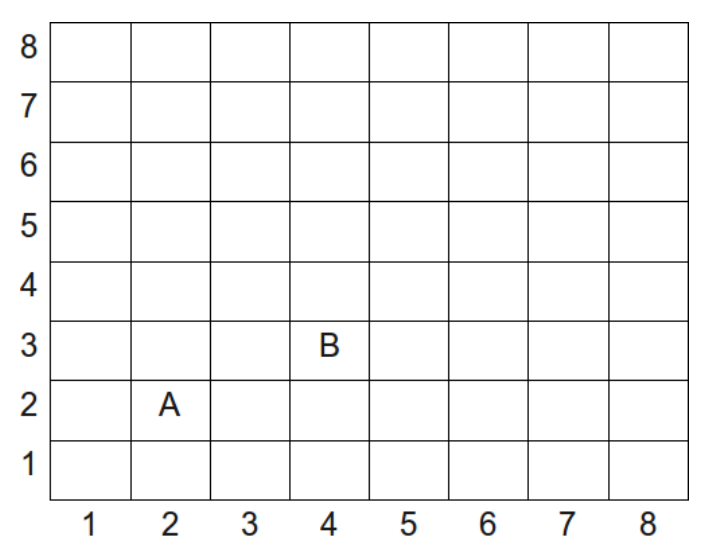
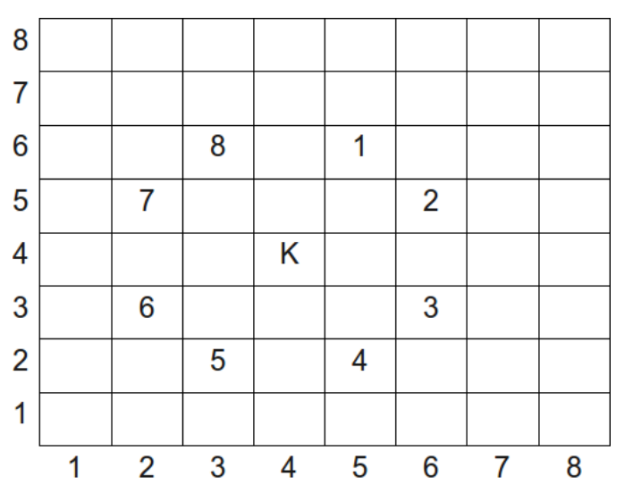

## 문제

Below is an 8 × 8 chessboard on which we will designate square locations using the ordered pairs as indicated. For example, notice that piece A is at position (2, 2) and piece B is at position (4, 3).

A knight is a special game piece that can leap over other pieces, moving in the “L” pattern. Specifically, in the diagram below, K represents the knight’s starting position and the numbers 1 through 8 represent possible places the knight may move to.

Your program will read the starting location of the knight and output the smallest number of jumps or moves needed to arrive at a location specified in the second input.

## 입력

Your program will read four integers, where each integer is in the range 1...8. The first two integers represent the starting position of the knight. The second two integers represent the final position of the knight.

## 출력

Your program should output the minimum (non-negative integer) number of moves required to move the knight from the starting position to the final position. Note that the knight is not allowed to move off the board during the sequence of moves.
