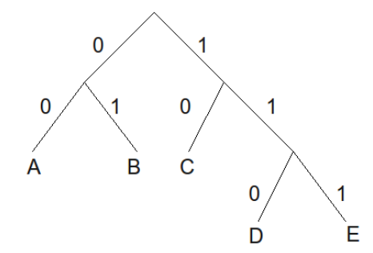

## 문제

There is an ingenious text-compression algorithm called Huffman coding, designed by David Huffman in 1952.

The basic idea is that each character is associated with a binary sequence (i.e., a sequence of 0s and 1s). These binary sequences satisfy the prefix-free property: a binary sequence for one character is never a prefix of another character’s binary sequence.

It is worth noting that to construct a prefix-free binary sequence, simply put the characters as the leaves of a binary tree, and label the “left” edge as 0 and the ”right” edge as 1. The path from the root to a leaf node forms the code for the character at that leaf node. For example, the following binary tree constructs a prefix-free binary sequence for the characters {A, B, C, D, E}:

That is, A is encoded as 00, B is encoded as 01, C is encoded as 10, D is encoded as 110 and E is encoded as 111.

The benefit of a set of codes having the prefix-free property is that any sequence of these codes can be uniquely decoded into the original characters.

Your task is to read a Huffman code (i.e., a set of characters and associated binary sequences) along with a binary sequence, and decode the binary sequence to its character representation.

## 입력

The first line of input will be an integer k (1 ≤ k ≤ 20), representing the number of characters and associated codes. The next k lines each contain a single character, followed by a space, followed by the binary sequence (of length at most 10) representing the associated code of that character. You may assume that the character is an alphabet character (i.e., ‘a’...‘z’ and ‘A’..‘Z’). You may assume that the sequence of binary codes has the prefix-free property. On the k + 2nd line is the binary sequence which is to be decoded. You may assume the binary sequence contains codes associated with the given characters, and that the k + 2nd line contains no more than 250 binary digits.

## 출력

On one line, output the characters that correspond to the given binary sequence.
