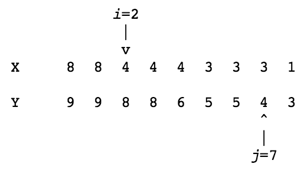

## 문제

Consider two descending sequences of integers X[0..n-1] and Y[0..n-1] with X[i] >= X[i+1] and Y[i] >= Y[i+1] and for all i, 0 ≤ i < n - 1. The distance between two elements X[i] and Y[j] is given by

d(X[i], Y[j]) = j - i if j ≥ i and Y[j] ≥ X[i], or 0 otherwise

The distance between sequence X and sequence Y is defined by

d(X, Y) = max{d(X[i], Y[j]) | 0 ≤ i < n, 0 ≤ j < n}

You may assume 0 < n < 1000.

For example, for the sequences X and Y below, their maximum distance is reached for i=2 and j=7, so d(X, Y)=d(X[2], Y[7])=5.

Part (a)

There is a maximum value of d(X, Y) over all sequences X and Y of length n. What property must the sequences satisfy in order to reach this value? There is a minimum value of d(X, Y). What property must the sequences satisfy in order to reach this value?

Part (b)

Write a program that repeatedly reads a pair of sequences of integers and prints the distance between those sequences. The first sequence is the X sequence and the second is the Y sequence. You may assume that the sequences are descending and of equal length. A pair of sequences is preceded by a number on a single line indicating the number of elements in the sequences. Numbers in a sequence are separated by a space, and each sequence is on a single line by itself. As usual, the first number in the input gives the number of test cases. Try to write an efficient program.

Part (c)

Give a very brief explanation of your program. Also, give a rough estimate of the maximum number of comparisons between elements of the two sequences that your program computes. (For example, n^2 can be considered a "rough estimate" of n^2 - 4.)
