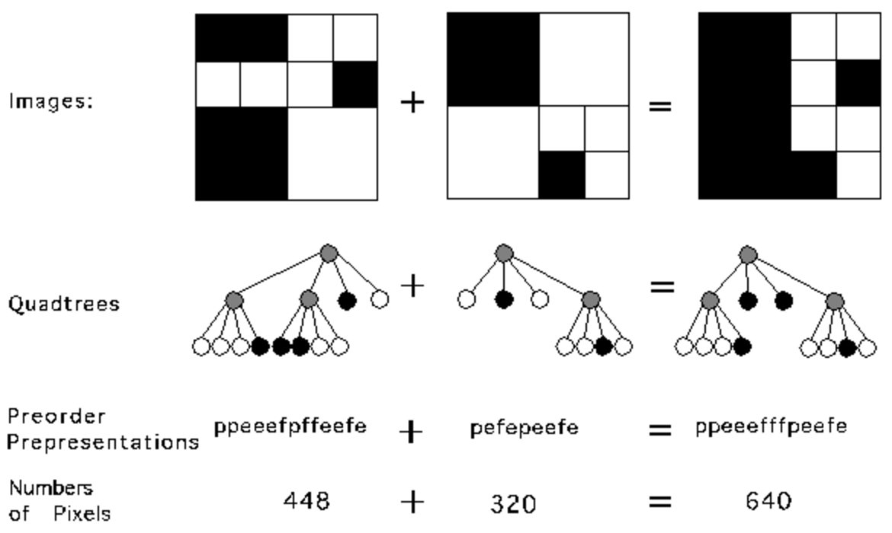
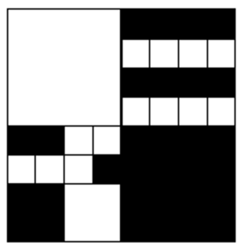

## 문제

A modern computer artist works with black-and-white images of 32 x 32 units, for a total of 1024 pixels per image. One of the operations the artist performs is "adding" two images together, to form a new image. In the resulting image a pixel is black if it was black in at least one of the component images, otherwise it is white.

A quadtree is a representation format used to encode images. The fundamental idea behind the quadtree is that any image can be split into four quadrants. Each quadrant may again be split in four subquadrants, etc. In the quadtree, the image is represented by a parent node, while the four quadrants are represented by four child nodes, in a predetermined order as shown in the figure below.

|  |  |
| --- | --- |
| 2 | 1 |
| 3 | 4 |

Of course, if the whole image is a single color, it can be represented by a quadtree consisting of a single node. In general, a quadrant needs only to be subdivided if it consists of pixels of different colors. As a result, the quadtree need not be of uniform depth.

The preorder representation of a quadtree consisting of a single node is given by `e', if the node represents an `empty' (white) quadrant, or `f', if the node represents a `full' (black) quadrant. The preorder representation of a quadtree of more than one node consists of the letter `p' (of "parent") followed by the preorder representation of the four subtrees in the order indicated in the figure below. See the figure for an example.

The artist believes in what is called the preferred fullness: for an image to be attractive the most important property is the number of filled (black) pixels in the image. Your job is to write a program that, given the quadtree representation of two images, calculates the number of pixels that are black when the two images are added.

In the figure, the first example is shown (from top to bottom) as image, quadtree, pre-order string and number of pixels. The quadrant numbering is shown at the top of the figure.

Questions

1. Give a preorder representation of the quadtree encoding the image below.  
   
2. What is the length of a shortest and a longest string representing the preorder traversal of a quadtree encoding an image of 32 x 32 pixels? Explain your answer.
3. Write a program satisfying the specification below.

## 입력

The first line of input specifies the number of test cases (N) your program has to process. The input for each test case is two strings, each string on its own line. The string is the pre-order representation of a quadtree. It is guaranteed that each string in the input represents a valid quadtree.

## 출력

For each test case, print on one line the text ``There are X black pixels.`', where X is the number of black pixels in the resulting image.
